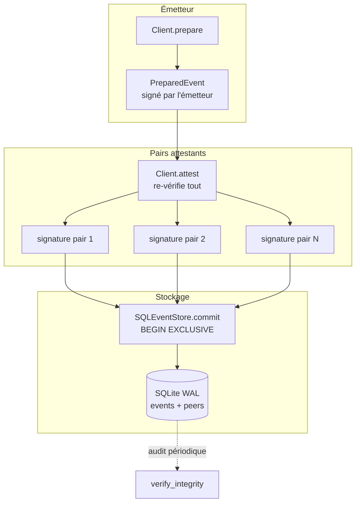
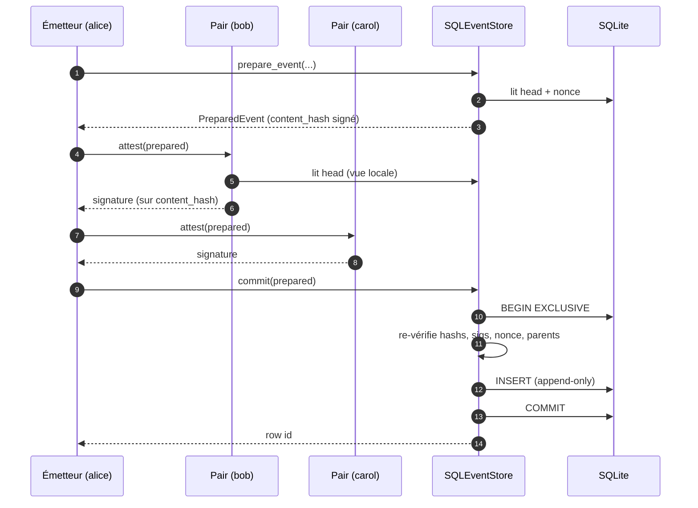
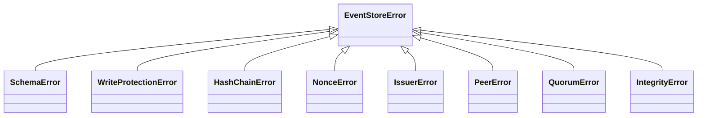

# CLAUDE.md — Guide du dépôt

Ce fichier oriente Claude Code lorsqu'il travaille dans ce dépôt. Il décrit le rôle de chaque module, les invariants à préserver et les commandes utiles.

## Vue d'ensemble

`event_store` est un journal d'événements **append-only** adossé à SQLite, conçu pour être inviolable :

- chaque événement est haché et chaîné aux **N derniers** (`hash_depth`, par défaut 4) — toute modification rétroactive casse la chaîne ;
- chaque événement est signé par son émetteur (Ed25519) puis attesté par un quorum de pairs (`peer_quorum`) ;
- l'horloge **HLC** (Hybrid Logical Clock) garantit un ordre monotone même en cas de gigue NTP ;
- des triggers SQL bloquent `UPDATE`/`DELETE` ; la falsification au niveau fichier est détectée par `verify_integrity()`.

## Architecture



## Modules

| Fichier | Rôle |
|---|---|
| [event_store/store.py](event_store/store.py) | `SQLEventStore`, `HLCClock`, primitives de hachage, dataclasses `PreparedEvent` / `StoredEvent`. |
| [event_store/client.py](event_store/client.py) | `Client` : émetteur + validateur. `attest()` re-dérive **tout** avant de signer. |
| [event_store/crypto.py](event_store/crypto.py) | Encapsulation Ed25519 (`KeyPair`, `verify_signature`). |
| [event_store/schema.py](event_store/schema.py) | DDL : tables `peers`, `events`, index, triggers anti-mutation. |
| [event_store/exceptions.py](event_store/exceptions.py) | Hiérarchie d'erreurs métier (`HashChainError`, `QuorumError`, …). |
| [demo.py](demo.py) | Démonstration de bout en bout avec 3 clients. |
| [tests/test_event_store.py](tests/test_event_store.py) | Suite pytest couvrant émission, attestation, intégrité. |

## Cycle de vie d'un événement



## Invariants à respecter

1. **`content_hash` ne dépend que du corps canonique** (`_canonical_json` avec `sort_keys=True`). Toute signature porte sur `content_hash` — jamais sur `row_hash`, qui dépend de la position dans la chaîne et peut être recalculé lors d'un *rebranch*.
2. **`row_hash` = SHA-256(content_hash || concat(parent_hashes))**. Les parents sont **les `hash_depth` row_hashes les plus récents** (du plus récent au plus ancien), complétés par `GENESIS_PAD` (`"0"*64`) si la chaîne est courte.
3. **Le nonce par émetteur est strictement croissant et sans trou**. La contrainte `UNIQUE(issuer_id, nonce)` le garantit côté SQL ; `_next_nonce` le calcule via `MAX(nonce)+1`.
4. **Le commit est sérialisé** par `_write_lock` côté Python **et** `BEGIN EXCLUSIVE` côté SQLite. Le *rebranch* relit la tête sous ce verrou — c'est ce qui permet de signer avant d'avoir la position finale.
5. **Un attestant ne signe jamais à l'aveugle.** `Client.attest` re-dérive `content_hash`, re-lit les parents depuis sa propre vue de la base, recompute `row_hash`, et vérifie le nonce. Toute simplification de cette routine est une régression de sécurité.
6. **L'horloge HLC doit être persistée** entre redémarrages pour ne pas émettre un événement avec un `physical_ms` antérieur à un événement déjà engagé.

## Surface d'erreurs



- `HashChainError` : parents incohérents ou `row_hash` recalculé différent.
- `NonceError` : rejeu ou trou dans la séquence d'un émetteur.
- `IssuerError` / `PeerError` : signature invalide ou identité non enregistrée.
- `QuorumError` : nombre de signatures valides < `peer_quorum`.
- `IntegrityError` : levée par `verify_integrity()` lors d'un audit ; révèle une falsification hors-API.
- `WriteProtectionError` : un trigger SQL a refusé un `UPDATE`/`DELETE`.

## Commandes courantes

```bash
# Installer les dépendances
pip install -r requirements.txt

# Démo complète (3 clients, quorum 3)
PYTHONPATH=. python demo.py

# Suite de tests
PYTHONPATH=. pytest -q

# Test ciblé
PYTHONPATH=. pytest tests/test_event_store.py::nom_du_test -q
```

## Points de vigilance pour les contributions

- **Ne jamais introduire de chemin d'`UPDATE`/`DELETE`** sur `events` ou `peers`. Toute évolution se fait par ajout d'un nouvel événement.
- **Conserver la sérialisation canonique** (`json.dumps(..., sort_keys=True, separators=(",", ":"), ensure_ascii=False)`). Modifier ce format invalide tous les hashs existants.
- **Toute nouvelle vérification doit être exécutée à la fois côté `Client.attest` et côté `SQLEventStore._insert_one`**. Le pair est la première ligne de défense ; le store est la dernière.
- **`hash_depth` et `peer_quorum` sont configurés à l'ouverture du store** ; les changer en cours de route casserait la re-dérivation des hashs lors de l'audit.
- Les tests doivent couvrir au moins : émission nominale, rejet d'émetteur inconnu, rejet de signature forgée, rejet de quorum insuffisant, détection de falsification par `verify_integrity()`.
