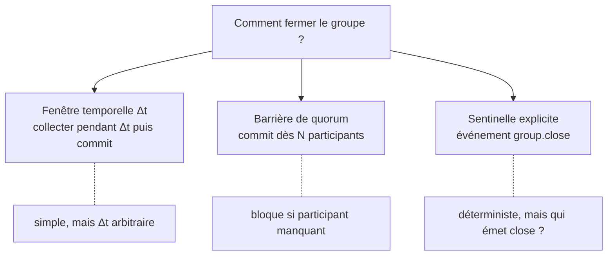
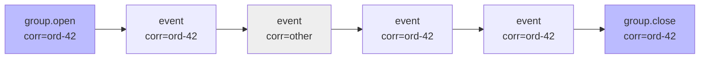
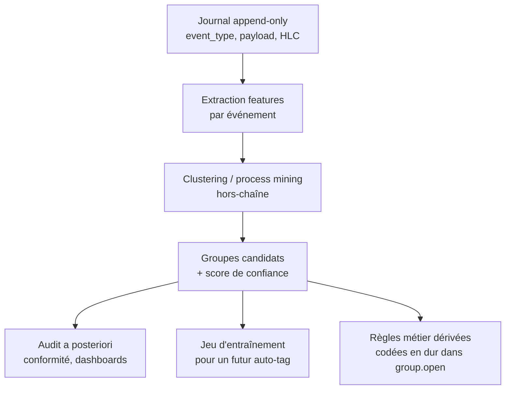
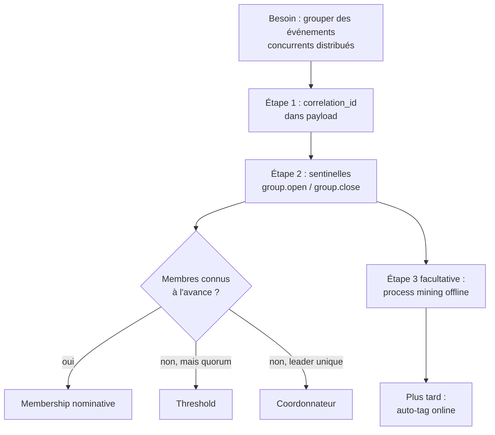

# Corrélation et regroupement d'événements

Note de conception sur la gestion de groupes d'événements réputés concurrents dans un déploiement distribué. Aucun de ces mécanismes n'est implémenté aujourd'hui — ce document décrit le raisonnement et les options pour quand le besoin se présentera.

---

## 1. Le problème

Sur une architecture distribuée, plusieurs émetteurs peuvent produire des événements **logiquement liés** (un workflow métier, une transaction multi-parties, une saga…) qui arrivent en quasi-simultané. Le journal les sérialise par HLC, mais rien dans le schéma actuel ne dit *« ces N événements forment un même groupe »*.

Question initiale : peut-on ajouter un identifiant de corrélation et traiter les événements de façon groupée s'ils arrivent ensemble, en considérant que les retardataires seront clairement ultérieurs ?

## 2. Premier réflexe : `correlation_id`

L'idée tient pour le **groupement logique**. Un `correlation_id` peut tout simplement vivre dans `payload` — zéro changement de schéma, zéro impact sur la chaîne cryptographique. `commit_batch()` existant fournit déjà l'atomicité + le tri HLC d'un lot.

```python
prepared = client.prepare(
    event_type="order.placed",
    payload={"correlation_id": "ord-42", "items": [...]},
)
```

## 3. Le vrai piège : la barrière

Ce n'est pas l'ID qui est dur, c'est de décider **quand le groupe est complet**. Et un « retardataire » par ordre d'arrivée peut avoir un HLC **antérieur** au lot déjà engagé (gigue NTP, transport lent), donc « clairement ultérieur » ne tient que si on définit explicitement la règle :

- **timestamp d'émission** (= HLC) : on rejette les arrivants tardifs sous le watermark — strict, mais perd des événements légitimes ;
- **timestamp d'arrivée** : simple à implémenter, mais réordonne par rapport à la causalité métier.



## 4. Choix retenu : la sentinelle `group.close`

Pattern le plus déterministe et le plus auditable : un événement métier explicite signe la fermeture du groupe. Le journal devient auto-suffisant — pas de timer externe, pas d'oracle.

Reste alors **la** question : comment connaître le groupe ?

## 5. Trois patterns pour définir le groupe

### 5.1. Membership déclarée à l'ouverture

Un événement `group.open` fixe la liste des participants attendus :

```json
{ "event_type": "group.open",
  "payload": {
    "correlation_id": "ord-42",
    "members": ["alice", "bob", "carol"]
  }
}
```

`group.close` est valide ssi tous les `members` ont au moins un événement portant `correlation_id="ord-42"` *entre* open et close. La vérification est triviale côté audit : on relit la slice de la chaîne entre les deux sentinelles.

### 5.2. Seuil sans nominatif

```json
{ "event_type": "group.open",
  "payload": { "correlation_id": "ord-42", "threshold": 3 }
}
```

`group.close` devient valide dès que N événements distincts (ou N émetteurs distincts) du `correlation_id` sont engagés. Plus souple, mais un latecomer arrivé après close est rejeté ou bascule dans un nouveau groupe.

### 5.3. Coordonnateur explicite

Un seul peer est habilité à émettre `group.close` pour un `correlation_id` donné, déclaré dans `group.open` :

```json
{ "event_type": "group.open",
  "payload": { "correlation_id": "ord-42", "coordinator": "alice" }
}
```

Les autres pairs **refusent à l'attest** un close émis par quelqu'un d'autre. La règle est appliquée côté `Client.attest` ET côté `SQLEventStore._insert_one` (cf. invariant 5 dans [CLAUDE.md](CLAUDE.md)).

### Définition canonique du groupe

Dans tous les cas :

> **Un groupe = slice contiguë de la chaîne entre `group.open` et `group.close`, filtrée par `correlation_id`.**

C'est la chaîne elle-même qui rend la réponse canonique, pas une structure externe. L'audit est purement déterministe.



Le groupe `ord-42` = `{open, E1, E2, E3, close}` — l'événement `other` est ignoré par le filtre.

## 6. Apprentissage automatique : découvrir les groupes ?

Question légitime : peut-on **apprendre** les groupes à partir de l'historique plutôt que de devoir les déclarer à la main ?

Oui — c'est un domaine établi qui s'appelle le **process mining** (Heuristics Miner, Inductive Miner, α-algorithm…) : découverte de groupes/processus à partir de logs d'événements bruts. Approches alternatives plus simples :

- fenêtres temporelles glissantes + **DBSCAN** sur les timestamps ;
- **embeddings d'événements** (event_type + features du payload) suivis d'un clustering ;
- **séquence mining** (PrefixSpan, SPADE) pour les sous-séquences fréquentes ;
- **graph clustering** sur les co-occurrences (community detection).

### Le tradeoff fondamental

Pour un journal **inviolable et auditable**, on ne veut pas que la définition du groupe dépende d'un modèle stochastique — sinon l'audit dit *« le modèle pensait que c'était groupé »* au lieu d'une preuve cryptographique.

> **Règle** : les sentinelles `group.open` / `group.close` restent **déterministes et signées** dans la chaîne. Le ML reste **hors-chaîne**.

### Deux usages possibles du ML

| Usage | Description | Quand |
|---|---|---|
| **Auto-tag à l'émission** | Le modèle prédit un `correlation_id` au moment du `prepare()` | Si downstream (sagas, alerting) doit réagir en temps réel |
| **Détection offline** | Le modèle mine l'historique pour découvrir des groupes implicites dans les événements non-tagués | Audits, dashboards, conformité, génération de jeux d'entraînement |

## 7. Recommandation : commencer par la détection offline

Pour deux raisons qui se cumulent :

1. **Risque zéro sur la chaîne** — analyse read-only sur l'historique, l'audit cryptographique n'est jamais perturbé par les incertitudes du modèle.
2. **C'est le prérequis de l'auto-tag** — sans étiquettes apprises offline, on n'a rien sur quoi entraîner un tagging online fiable.

Le seul tradeoff réel : la **latence de découverte**. Un groupe n'est « connu » qu'une fois que le batch d'analyse a tourné — donc inadapté si on veut réagir dans la seconde. Pour des audits, dashboards ou de la conformité, c'est largement suffisant.



### Pipeline esquissée

| Étape | Question | Sortie |
|---|---|---|
| 1. Extraction | Quelles features par événement ? | `(event_type, payload_keys, issuer, hlc_delta)` |
| 2. Représentation | Vectoriel ou séquentiel ? | embeddings ou n-grams |
| 3. Découverte | Quel algo ? | DBSCAN temporel / process mining / clustering d'embeddings |
| 4. Validation | Comment scorer un groupe ? | cohésion intra-groupe, séparation inter-groupes |
| 5. Sortie | Que produit-on ? | annotations `(correlation_id_predit, score)` à côté de la chaîne |

## 8. Synthèse



- **Court terme** : pas besoin d'ML. Un `correlation_id` dans le payload + `group.open` / `group.close` couvrent 90 % des cas, sans toucher aux invariants cryptographiques.
- **Moyen terme** : process mining offline pour découvrir des groupes implicites dans l'historique — utile pour la conformité et la documentation des processus métier.
- **Long terme** : auto-tag à l'émission, **seulement si** un consommateur temps réel le justifie, et **seulement si** l'historique offline a produit un modèle dont on a mesuré la fiabilité.

L'ordre de ces étapes n'est pas une coquetterie : chaque palier valide les hypothèses du suivant.
