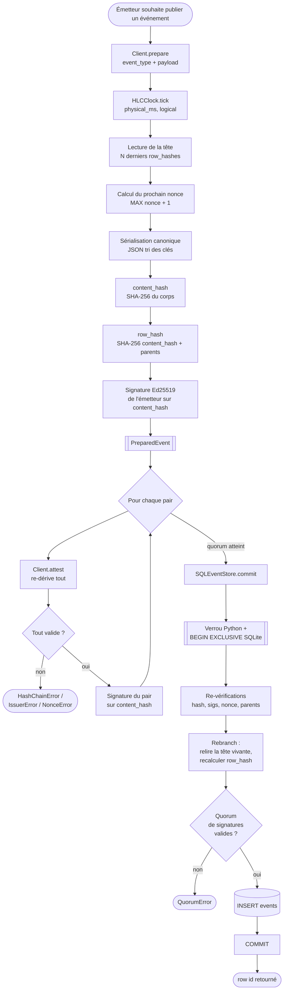
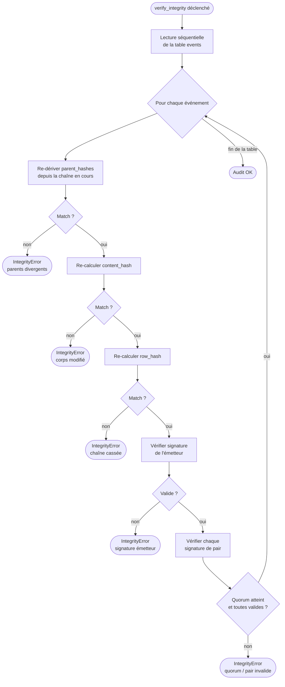

# Flux d'un événement

Diagramme vertical du parcours complet d'un événement, de la préparation par l'émetteur à la persistance dans SQLite.

## Parcours principal

## Détection des falsifications

