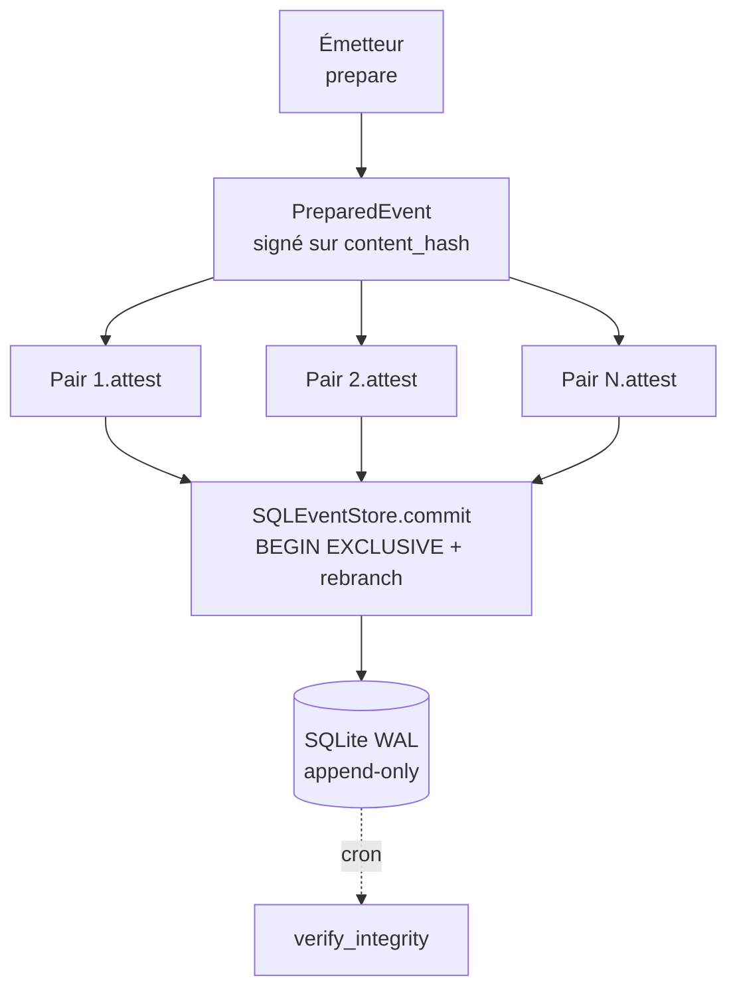

# Python.Blockchain.EventStore

Journal d'événements **append-only** sur SQLite, avec chaînage de hashs N-back, attestation par les pairs (Ed25519 + quorum) et ordre monotone par horloge logique hybride (HLC).

> *Append-only SQL event store with N-back hash chaining, Ed25519 peer attestation and HLC ordering.*

## Pourquoi

Un journal qui doit pouvoir être audité bien après écriture, sans dépendre d'un nœud central de confiance. Chaque événement :

- est haché et chaîné aux **N derniers** (`hash_depth`) — toute réécriture rétroactive casse la chaîne ;
- est signé par son émetteur, puis **attesté par un quorum de pairs** indépendants (Ed25519) ;
- porte une horloge HLC monotone, robuste à la gigue NTP ;
- est protégé au niveau SQL par des triggers `BEFORE UPDATE/DELETE` ; toute falsification au niveau fichier est détectée par `verify_integrity()`.

## Installation

```bash
git clone https://github.com/venantvr-ia/Python.Blockchain.EventStore.git
cd Python.Blockchain.EventStore
python -m venv .venv && source .venv/bin/activate
pip install -r requirements.txt
```

## Démarrage rapide

```python
from event_store import SQLEventStore, Client, KeyPair, HLCClock

store = SQLEventStore("log.db", hash_depth=4, peer_quorum=3)
store.initialize()

# Bootstrap : 3 pairs, chacun avec sa propre paire de clés
keypairs = {n: KeyPair.generate() for n in ("alice", "bob", "carol")}
for name, kp in keypairs.items():
    store.register_peer(name, kp.public_key_hex)

clients = {n: Client(n, kp, store, hlc_clock=HLCClock())
           for n, kp in keypairs.items()}

# alice émet, bob et carol attestent
prepared = clients["alice"].prepare(
    event_type="account.opened",
    payload={"account": "ACC-001"},
)
msg = prepared.content_hash.encode("utf-8")
prepared.peer_sigs["alice"] = clients["alice"].keypair.sign(msg)
prepared.peer_sigs["bob"]   = clients["bob"].attest(prepared,
    issuer_public_key=clients["alice"].public_key_hex())
prepared.peer_sigs["carol"] = clients["carol"].attest(prepared,
    issuer_public_key=clients["alice"].public_key_hex())

row_id = store.commit(prepared)
store.verify_integrity()   # audit complet, lève IntegrityError si KO
```

Démo de bout en bout (3 clients, scénarios d'attaque) :

```bash
PYTHONPATH=. python demo.py
```

Tests :

```bash
PYTHONPATH=. pytest -q
```

## Architecture en un diagramme



## Documentation

| Fichier | Rôle |
|---|---|
| [USAGE.md](USAGE.md) | **Guide pratique** : bootstrap, déploiement multi-clients, opérations, checklist J+1 |
| [CLAUDE.md](CLAUDE.md) | Architecture, invariants, points de vigilance pour les contributions |
| [FLOW.md](FLOW.md) | Diagrammes verticaux du flux nominal et de l'audit d'intégrité |
| [CORRELATION.md](CORRELATION.md) | Note de conception : groupement d'événements (correlation_id, sentinelles, process mining) |
| [docs/](docs/README.md) | **Notes de conception** par sujet : audit incrémental, RGPD, sharding, forks, observabilité… (17 docs) |
| [demo.py](demo.py) | Démo de bout en bout incluant des tentatives d'attaque |
| [tests/test_event_store.py](tests/test_event_store.py) | Suite pytest commentée en français |

## Surface d'API

```python
from event_store import (
    SQLEventStore, Client, KeyPair, HLCClock,
    PreparedEvent, StoredEvent,
    compute_content_hash, compute_row_hash, pad_parent_hashes, GENESIS_PAD,
    verify_signature,
    EventStoreError, HashChainError, IntegrityError, IssuerError,
    NonceError, PeerError, QuorumError, SchemaError, WriteProtectionError,
)
```

## Limites connues

- **Pas de couche réseau livrée** : pour un déploiement multi-machines, écrire son propre transport (HTTP, broker, etc.) pour échanger les `PreparedEvent` entre pairs. Voir [USAGE.md §2](USAGE.md) pour les modes de déploiement.
- **Persistance HLC à la charge de l'appelant** : sérialiser `HLCClock.state()` au shutdown.
- **Pas de rotation de clés native** : se faire via un événement métier `peer.revoked`.
- **Audit O(n)** : ré-vérifier toute la chaîne à chaque appel à `verify_integrity()`. Acceptable jusqu'à plusieurs millions d'événements.

## Licence

À définir.
