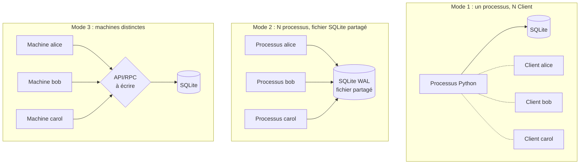
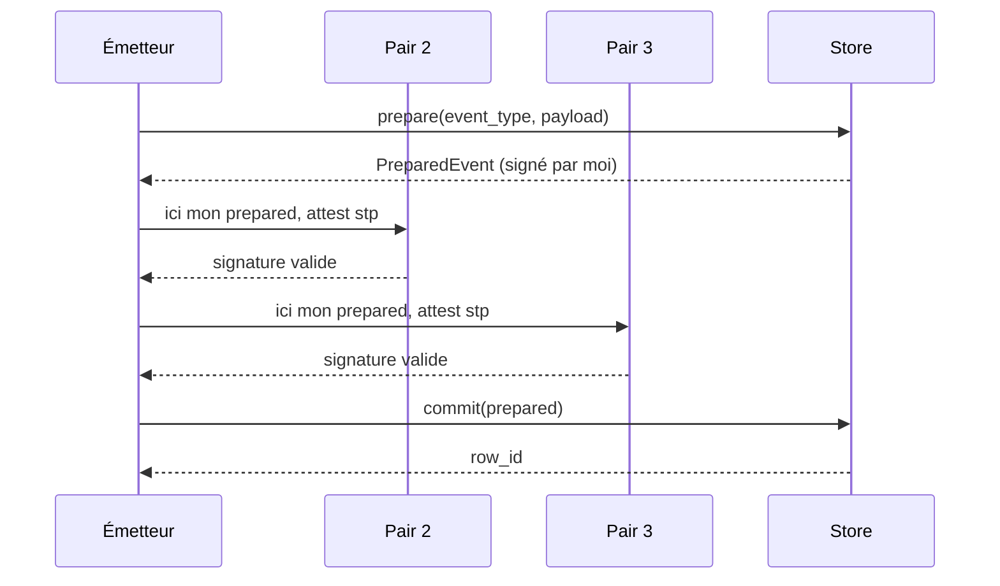

# Guide d'utilisation — démarrer avec plusieurs clients

Ce guide t'amène d'une base vide à un journal d'événements multi-clients opérationnel. Suis-le dans l'ordre la première fois ; les sections suivantes sont des références.

---

## 1. Prérequis

- Python ≥ 3.9
- Un répertoire partagé entre tes clients pour le fichier SQLite (NFS, volume Docker, ou simple répertoire local si les clients tournent sur la même machine)
- Un canal **hors-bande** pour échanger les clés publiques entre pairs (Signal, mail signé, dépôt git interne… peu importe, tant qu'on peut authentifier la source)

```bash
python -m venv .venv
source .venv/bin/activate
pip install -r requirements.txt
```

---

## 2. Choisir un modèle de déploiement



| Mode | Quand le choisir | Limites |
|---|---|---|
| **1 — single process** | Démo, tests, agrégateur unique avec sources internes | Pas de séparation de privilèges entre clients |
| **2 — multi-process / même machine** | Plusieurs services locaux qui co-signent | SQLite WAL gère bien la concurrence ; un crash de processus n'affecte pas les autres |
| **3 — machines distinctes** | Cas réel multi-organisations | **Tu dois écrire la couche RPC** : `prepare` → diffuse → collecte attestations → `commit`. Le code livré ne fournit pas le transport. |

> Pour « demain », commence en mode **2** : c'est le sweet spot pour un POC réaliste sans avoir à coder de RPC.

---

## 3. Bootstrap : la toute première fois

À faire **une seule fois**, par un opérateur qui a la confiance de tous les pairs (ou par chaque pair en se synchronisant). L'idée : créer le fichier de base, enregistrer les clés publiques de tous les pairs avant la première émission.

```python
from event_store import SQLEventStore, KeyPair

DB_PATH = "/var/lib/evstore/log.db"

store = SQLEventStore(
    DB_PATH,
    hash_depth=4,    # chaque événement référence les 4 derniers
    peer_quorum=3,   # 3 signatures valides exigées par commit
)
store.initialize()   # crée tables, index, triggers — idempotent
```

### 3.1. Génération des clés (chaque pair, sur SA machine)

**La clé privée ne doit jamais quitter la machine du pair.** Chaque pair génère son propre `KeyPair`, garde la clé privée localement, et publie uniquement la clé publique :

```python
from event_store import KeyPair

kp = KeyPair.generate()
print("public_key_hex =", kp.public_key_hex)   # à envoyer aux autres
# kp._private : à sauvegarder en lieu sûr (HSM, vault, fichier chiffré)
```

> Le code actuel ne sérialise pas la clé privée — pour la persister entre redémarrages, écris ton propre wrapper autour de `Ed25519PrivateKey.private_bytes(...)` (cf. `cryptography.hazmat`).

### 3.2. Enregistrement des pairs

L'opérateur de bootstrap collecte les `public_key_hex` reçus et les enregistre :

```python
PEERS = {
    "alice": "a1b2c3...",   # reçu d'alice par canal hors-bande
    "bob":   "d4e5f6...",
    "carol": "789abc...",
}
for peer_id, pk_hex in PEERS.items():
    store.register_peer(peer_id, pk_hex)
```

À partir de ce moment, le journal est prêt à recevoir des événements signés par ces trois pairs.

---

## 4. Émettre un événement (le flux quotidien)

Un événement passe par 3 étapes : **prépare** → **atteste** (par chaque pair) → **commit**.



### 4.1. Côté émetteur (alice)

```python
from event_store import Client, HLCClock

# Charger sa clé privée + récupérer le store partagé
alice = Client("alice", alice_keypair, store, hlc_clock=HLCClock())

prepared = alice.prepare(
    event_type="account.opened",
    payload={"account": "ACC-001", "owner": "Alice"},
)

# alice s'auto-atteste (son rôle de pair compte dans le quorum)
msg = prepared.content_hash.encode("utf-8")
prepared.peer_sigs["alice"] = alice.keypair.sign(msg)
```

### 4.2. Côté chaque autre pair (bob, carol)

Le `PreparedEvent` est envoyé aux autres pairs (peu importe le transport — JSON sur HTTP, message broker, fichier partagé, etc.). Chaque pair re-vérifie **tout** avant de signer :

```python
# Sur la machine de bob
sig = bob.attest(prepared, issuer_public_key=alice_public_key_hex)
# attest() lève HashChainError / IssuerError / NonceError si quelque chose cloche.
# Si elle réussit, sig est la signature hex de bob sur content_hash.

# bob renvoie sa signature à alice (à nouveau, transport au choix)
```

### 4.3. Retour côté alice : commit

```python
prepared.peer_sigs["bob"] = sig_de_bob
prepared.peer_sigs["carol"] = sig_de_carol

row_id = store.commit(prepared)
print(f"événement {row_id} engagé, hauteur de chaîne = {store.height()}")
```

> **Important** — entre `prepare` et `commit`, d'autres clients peuvent avoir engagé des événements. Le store re-lit la tête sous verrou exclusif et **rebranch** automatiquement le `row_hash`. Les signatures restent valides car elles portent sur `content_hash`, qui ne dépend pas de la position.

---

## 5. Sérialiser un PreparedEvent pour le transport

Le code livré n'inclut pas de helper de sérialisation. Voici le pattern minimal :

```python
import json
from dataclasses import asdict

def to_wire(prepared) -> str:
    return json.dumps(asdict(prepared), sort_keys=True)

def from_wire(raw: str):
    from event_store import PreparedEvent
    return PreparedEvent(**json.loads(raw))
```

Le payload reste un `dict` JSON-sérialisable de bout en bout — pas de surprise sur les types.

---

## 6. Lire les événements

Deux ordres possibles :

```python
# Ordre d'insertion (id croissant) — utile pour la réplication
for ev in store.read_all():
    print(ev.id, ev.issuer_id, ev.event_type, ev.payload)

# Ordre d'émission (HLC croissant) — utile pour la timeline métier
for ev in store.read_in_emission_order():
    ...
```

`store.height()` retourne le nombre total d'événements.

---

## 7. Audit d'intégrité (à planifier en cron)

À exécuter régulièrement (par ex. toutes les heures, et à chaque démarrage). Re-dérive tous les hashs et re-vérifie toutes les signatures depuis le début :

```python
from event_store import IntegrityError

try:
    store.verify_integrity()
    print("OK")
except IntegrityError as exc:
    # Alerter immédiatement — le journal a été falsifié hors-API,
    # ou un bug a corrompu une écriture.
    notify_oncall(f"intégrité KO : {exc}")
```

> Coût : O(n) avec re-vérification de signatures. Tolérable jusqu'à quelques millions d'événements ; au-delà, prévoir un audit incrémental (à coder).

---

## 8. Bonnes pratiques opérationnelles

### Persistance de l'horloge HLC

Si un pair redémarre et émet un événement avec un `physical_ms` antérieur à l'horloge système au moment du précédent, le store ne l'empêche pas tant que le nonce reste correct, **mais** ça casse l'ordre HLC global. Solution : sérialiser l'état HLC entre redémarrages.

```python
# À l'arrêt
phys, logi = client.hlc_clock.state()
save_to_disk({"physical_ms": phys, "logical": logi})

# Au démarrage
state = load_from_disk()
client.hlc_clock = HLCClock(physical_ms=state["physical_ms"], logical=state["logical"])
```

### Sauvegardes

- Le fichier SQLite + ses fichiers WAL (`-wal`, `-shm`) doivent être sauvegardés ensemble (utiliser `sqlite3 .backup` ou copier après un `PRAGMA wal_checkpoint(TRUNCATE)`).
- Comme la chaîne est append-only, une sauvegarde incrémentale (rsync) marche bien — on ne perd jamais d'écritures rétro-actives car il n'y en a pas.

### Rotation des clés

Pas supporté nativement. Pour révoquer un pair compromis : **émettre un événement métier** (`event_type="peer.revoked"`) et faire en sorte que tes consommateurs ignorent les attestations postérieures de ce peer_id. La table `peers` reste figée (les triggers bloquent UPDATE/DELETE).

### Choix de `hash_depth` et `peer_quorum`

| Paramètre | Petit (1-2) | Grand (5+) |
|---|---|---|
| `hash_depth` | Détection de réécriture rapide | Plus grande tolérance aux ré-orderings, mais audit plus coûteux |
| `peer_quorum` | Faible coordination, faible sécurité | Forte sécurité, latence supérieure |

Une fois le store en production, **ne change plus ces valeurs** : la re-dérivation des hashs lors de l'audit suppose que `hash_depth` est constant sur toute la chaîne.

---

## 9. Erreurs courantes et que faire

| Exception | Cause typique | Action |
|---|---|---|
| `IssuerError` au prepare | Émetteur pas dans `peers` | Vérifier que `register_peer()` a été appelé |
| `HashChainError` à attest | Le pair a une vue divergente de la tête | Resynchroniser ; le pair en retard doit re-lire la base |
| `NonceError` au commit | Deux émissions concurrentes du même pair | Sérialiser les `prepare()` côté client (même `Client` instance ou sémaphore) |
| `QuorumError` au commit | Pas assez de signatures collectées | Réessayer avec plus de pairs disponibles |
| `PeerError` au commit | Signature forgée OU peer_id absent de `peers` | Audit de sécurité du pair concerné |
| `IntegrityError` à verify | Falsification fichier OU bug de migration | **Page on-call** ; isoler la base, comparer aux sauvegardes |

---

## 10. Checklist J+1 (avant la mise en prod)

- [ ] Fichier `log.db` créé, `initialize()` appelé une seule fois
- [ ] Toutes les clés publiques de pairs enregistrées via `register_peer()`
- [ ] Chaque pair a sauvegardé sa clé privée de façon chiffrée et **hors** du dépôt
- [ ] Mécanisme de transport `PreparedEvent` ↔ pairs implémenté (HTTP, broker, fichier…)
- [ ] Sérialisation/désérialisation testée sur des events réels
- [ ] Persistance de `HLCClock` entre redémarrages branchée
- [ ] Cron `verify_integrity()` planifié + chemin d'alerte vérifié
- [ ] Sauvegarde planifiée (avec WAL inclus)
- [ ] Procédure de révocation de pair documentée pour ton équipe
- [ ] [demo.py](demo.py) tourne dans ton environnement (pour valider l'install)

---

## Pour aller plus loin

- Architecture détaillée et invariants : [CLAUDE.md](CLAUDE.md)
- Diagrammes de flux complets (commit + audit) : [FLOW.md](FLOW.md)
- Tests qui documentent chaque contrat : [tests/test_event_store.py](tests/test_event_store.py)
