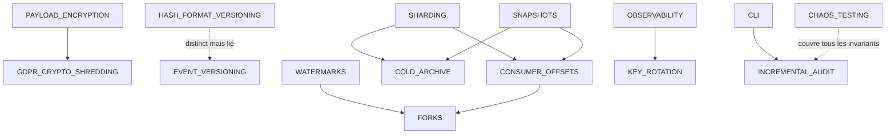

# Documentation de conception

Notes de conception pour les enjeux d'évolution du store. Aucun de ces mécanismes n'est implémenté aujourd'hui — chaque doc décrit le problème, les options, la recommandation, l'intégration au code actuel, et les limites.

À lire dans l'ordre où les besoins se présentent — pas linéairement.

## Sécurité & cryptographie

| Doc | Sujet | Priorité typique |
|---|---|---|
| [INCREMENTAL_AUDIT.md](security/INCREMENTAL_AUDIT.md) | Checkpoints signés + échantillonnage pour rendre `verify_integrity()` viable au-delà de 100 k events | Haute dès ~100 k events |
| [HASH_FORMAT_VERSIONING.md](security/HASH_FORMAT_VERSIONING.md) | Versionner le format de sérialisation canonique pour pouvoir le faire évoluer sans casser l'historique | Avant le premier changement de format |
| [KEY_ROTATION.md](security/KEY_ROTATION.md) | Événements `peer.revoked` / `peer.rotated` interprétés par l'audit | Avant la première compromission |
| [PAYLOAD_ENCRYPTION.md](security/PAYLOAD_ENCRYPTION.md) | Envelope encryption par sujet ; le hash porte sur le ciphertext | Si PII ou secrets dans le payload |

## Données & modélisation

| Doc | Sujet | Priorité typique |
|---|---|---|
| [EVENT_VERSIONING.md](data/EVENT_VERSIONING.md) | `event_version` dans le payload + upcasters côté consommateur | Avant le premier changement de schéma métier |
| [GDPR_CRYPTO_SHREDDING.md](data/GDPR_CRYPTO_SHREDDING.md) | Effacement par destruction de KEK ; conserve l'auditabilité de la chaîne | Si données soumises au RGPD |
| [SNAPSHOTS.md](data/SNAPSHOTS.md) | Snapshots dans la chaîne pour éviter le replay total au démarrage | Dès que rebuild devient lent |

## Échelle & performance

| Doc | Sujet | Priorité typique |
|---|---|---|
| [SHARDING.md](scale/SHARDING.md) | Sharding par hash(issuer) avec chaîne maîtresse de scellement | Si > 500 commits/s |
| [BACKPRESSURE.md](scale/BACKPRESSURE.md) | Token bucket par émetteur + événement `quota.exceeded` | Avant la mise en production multi-tenant |
| [SECONDARY_INDEXES.md](scale/SECONDARY_INDEXES.md) | Read models CQRS + index SQL ciblés sur `events` | Dès la première requête métier |

## Distribution & cohérence

| Doc | Sujet | Priorité typique |
|---|---|---|
| [FORKS.md](distribution/FORKS.md) | Détection et merge de divergence après partition réseau | Si déploiement multi-DC |
| [WATERMARKS.md](distribution/WATERMARKS.md) | Heartbeats par pair pour calculer un watermark de complétude | Pour les agrégations temporelles |
| [CONSUMER_OFFSETS.md](distribution/CONSUMER_OFFSETS.md) | Offset = `(row_id, content_hash)` + handlers idempotents | Dès le premier consommateur |

## Opérations & cycle de vie

| Doc | Sujet | Priorité typique |
|---|---|---|
| [COLD_ARCHIVE.md](operations/COLD_ARCHIVE.md) | Archivage de tranches anciennes en Parquet signé, ancré dans la chaîne vive | Au-delà de quelques To |
| [CLI.md](operations/CLI.md) | CLI Typer (`evstore inspect`, `audit`, `export`…) pour les opérateurs | Avant la mise en production |
| [OBSERVABILITY.md](operations/OBSERVABILITY.md) | Métriques Prometheus + logs structurés + traces OpenTelemetry | Avant la mise en production |
| [CHAOS_TESTING.md](operations/CHAOS_TESTING.md) | Property-based tests (Hypothesis) + chaos d'intégration | Dès que la base de tests stabilise |

## Carte des dépendances entre docs

## Recommandation d'ordre d'implémentation

Si tu démarres demain, ordre suggéré :

1. **CONSUMER_OFFSETS** + **OBSERVABILITY** + **CLI** — sans ces trois, pas d'opération sérieuse.
2. **EVENT_VERSIONING** — convention à poser avant le premier event en prod.
3. **GDPR_CRYPTO_SHREDDING** + **PAYLOAD_ENCRYPTION** — si le moindre risque PII.
4. **INCREMENTAL_AUDIT** + **SNAPSHOTS** — quand la chaîne dépasse ~100 k events.
5. **KEY_ROTATION** — avant la première suspicion de compromission.
6. **CHAOS_TESTING** — en arrière-plan, dès que possible.
7. **WATERMARKS** + **BACKPRESSURE** — selon les besoins multi-pair.
8. **SHARDING** + **FORKS** + **COLD_ARCHIVE** + **SECONDARY_INDEXES** + **HASH_FORMAT_VERSIONING** — quand le besoin se présente, pas avant.
