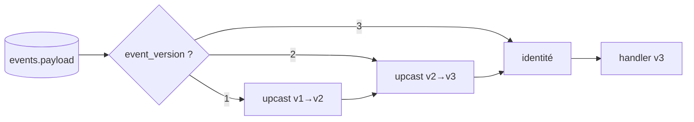

# Versioning du schéma d'événements

## Problème

Un `event_type="order.placed"` v1 (`{order_id, items}`) n'a pas la même forme qu'un v2 (`{order_id, items, currency}`). Sans gestion explicite de version :

- les anciens consommateurs cassent quand v2 arrive ;
- les nouveaux consommateurs ne savent pas lire les v1 existants ;
- l'audit de la chaîne ne distingue pas les formats.

Et comme le journal est append-only, **on ne peut pas re-écrire les v1 en v2**. Les deux formats coexistent à vie.

## Options et tradeoffs

| Option | Idée | Côté lecture | Évolution |
|---|---|---|---|
| **Champ `event_version`** | Numéroter chaque payload | Le consommateur dispatche | Simple, ajout-additif |
| **Type explicite par version** | `order.placed.v1`, `order.placed.v2` | Pas d'ambiguïté | Pollue les noms |
| **Schémas externes** (Avro, Protobuf, JSON Schema) | Schéma référencé dans un registry | Validation forte, codegen possible | Dépendance lourde |
| **Upcasters** (Greg Young) | Pipeline `v1 → v2 → v3` côté lecture, le consommateur ne voit que la version max | Code applicatif simple | Coût mémoire et CPU à la lecture |

## Recommandation

**`event_version` dans le payload + upcasters** côté consommateur. Le store reste agnostique (il signe et hash le JSON tel quel) ; la complexité de migration vit dans le code applicatif, qui est testable, versionnable et déployable indépendamment.

```python
# Émission v2
client.prepare(
    event_type="order.placed",
    payload={"event_version": 2, "order_id": "o-1", "items": [...], "currency": "EUR"},
)

# Lecture
def upcast(payload: dict) -> dict:
    v = payload.get("event_version", 1)
    if v == 1:
        payload = {**payload, "event_version": 2, "currency": "EUR"}  # default
    return payload

for ev in store.read_all():
    p = upcast(ev.payload)
    handle(p)
```



## Schéma proposé

Convention claire dans le payload :

```json
{
  "event_version": 2,
  "order_id": "o-1",
  "items": [...],
  "currency": "EUR"
}
```

Côté lecture, un module `upcasters.py` par bounded context :

```python
UPCASTERS: dict[tuple[str, int], Callable[[dict], dict]] = {
    ("order.placed", 1): lambda p: {**p, "event_version": 2, "currency": "EUR"},
}

def upcast(event_type: str, payload: dict) -> dict:
    while (event_type, payload.get("event_version", 1)) in UPCASTERS:
        payload = UPCASTERS[(event_type, payload["event_version"])](payload)
    return payload
```

## Intégration au store actuel

- **Aucune modification du core** — `event_version` n'est qu'une convention de payload.
- **Tests applicatifs** : un test par règle d'upcast, plus un test d'idempotence (`upcast(upcast(p)) == upcast(p)`).
- **Lint optionnel** : un test peut imposer que tout payload comporte `event_version`.

## Limites / risques

- **Downcast impossible** : si un v3 ajoute un champ obligatoire, un consommateur qui ne connaît que v1 ne peut pas le traiter raisonnablement. Politique : downcasting interdit, les anciens consommateurs doivent être mis à jour.
- **Drift de schéma** : sans validation centralisée, un émetteur peut produire un v2 mal formé. Mitigation : validation côté `Client.prepare` (JSON Schema en amont), refus à l'émission.
- **Versioning du `event_type` lui-même** : renommer `order.placed` en `purchase.placed` n'est pas un upcast, c'est un nouveau type. Conserver l'ancien à vie dans les handlers historiques.
- **Compatibilité avec hash format** : `event_version` n'a rien à voir avec `hash_format_version` ([HASH_FORMAT_VERSIONING.md](../security/HASH_FORMAT_VERSIONING.md)) ; le premier concerne la sémantique métier, le second la dérivation cryptographique.
