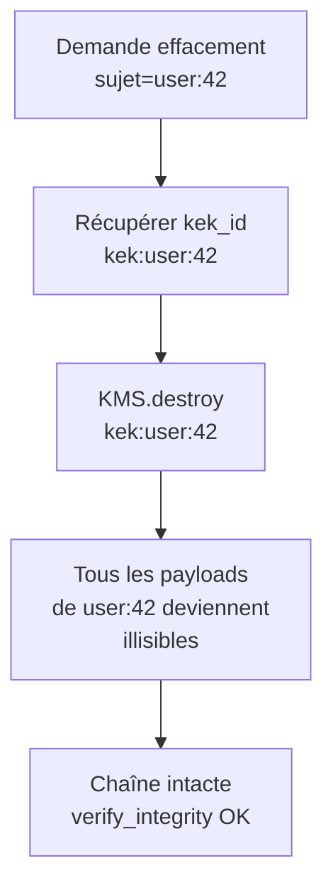

# RGPD et crypto-shredding

## Problème

Le RGPD (article 17) impose le **droit à l'effacement** : un sujet peut exiger que ses données personnelles soient supprimées. Or le journal est :

- **append-only** par construction (triggers SQL bloquant `UPDATE`/`DELETE`, [event_store/schema.py](../../event_store/schema.py)) ;
- **inviolable** par design — supprimer une ligne casserait la chaîne de hashs.

Le conflit est frontal : on ne peut pas effacer sans détruire l'auditabilité, et on ne peut pas garder sans violer le RGPD.

## Options et tradeoffs

| Option | Idée | Compatibilité chaîne | Granularité |
|---|---|---|---|
| **Tout chiffrer + détruire la clé** (*crypto-shredding*) | Chaque sujet a une clé ; détruire la clé rend illisible | Parfaite — les hashs portent sur le ciphertext, inchangés | Par sujet |
| **Pseudonymisation à l'émission** | Remplacer les PII par des tokens, table de correspondance externe | Parfaite | Par champ |
| **Stockage PII séparé** | Le journal ne stocke que des références ; les PII vivent dans une base classique mutable | Parfaite | Par champ, gestion fine |
| **Réécriture de la chaîne** | Re-générer l'historique en omettant les events à effacer | **Impossible** : casse les signatures et les hashs | — |

## Recommandation

**Crypto-shredding par sujet**, en s'appuyant sur l'envelope encryption décrite dans [PAYLOAD_ENCRYPTION.md](../security/PAYLOAD_ENCRYPTION.md).

- Une **KEK** (key-encryption key) par sujet RGPD (par utilisateur, par compte, par employé…), gardée dans un KMS.
- Chaque payload contenant des PII de ce sujet est chiffré avec une DEK aléatoire, elle-même wrappée par la KEK.
- **Effacer un sujet = détruire sa KEK** dans le KMS. Tous les ciphertexts associés deviennent irrécupérables, mais les hashs et la structure de la chaîne restent intacts.



## Schéma proposé

À l'émission :

```python
prepared = client.prepare_encrypted(
    event_type="profile.updated",
    plaintext_payload={"user_id": 42, "email": "alice@example.com"},
    kek_id="user:42",
)
```

À l'effacement (sur demande RGPD) :

```python
def shred_subject(kms, subject_kek_id: str) -> None:
    """Effacement définitif. À journaliser dans un journal RGPD séparé."""
    kms.destroy_key(subject_kek_id)
```

Émission d'une trace **dans la chaîne** (sans PII) pour preuve de traitement :

```python
client.prepare(
    event_type="gdpr.shredded",
    payload={"kek_id": "user:42", "requested_at": ts, "operator": "dpo-bob"},
)
```

## Intégration au store actuel

- **Aucune modification du core**. La chaîne ne sait pas qu'il y a chiffrement ; elle continue à hash et signer le ciphertext.
- **Couche au-dessus** : `EncryptedClient` + KMS (cf. [PAYLOAD_ENCRYPTION.md](../security/PAYLOAD_ENCRYPTION.md)).
- **Convention** : tout payload contenant des PII **doit** être chiffré et porter `kek_id`. À auditer par un test de conformité (parcours de la chaîne, alerte si `event_type` connu pour porter des PII et `payload` non chiffré).

## Limites / risques

- **Granularité du sujet** : si un payload contient des PII de plusieurs sujets (ex. transaction entre alice et bob), il faudra **soit** chiffrer avec deux KEK (multi-recipient encryption), **soit** stocker les PII dans des events séparés par sujet.
- **PII dans les métadonnées** : `issuer_id="user:42"` est une PII en clair. Pour effacement complet, l'ID d'émetteur doit être un pseudonyme stable et non-réversible (et la table de correspondance dans un système séparé qu'on peut purger).
- **Logs et backups** : crypto-shredding ne couvre que la chaîne. Les logs applicatifs, les backups SQL, les exports analytiques peuvent contenir le clair — politique d'effacement à étendre à tous les chemins.
- **Auditabilité historique partielle** : après shredding, on ne peut plus prouver le contenu exact du payload, seulement qu'il a été commité (hash + sigs). Garder l'événement `gdpr.shredded` pour documenter l'effacement.
- **Quantum** : si un attaquant a copié les ciphertexts et qu'AES-256 est cassé un jour, le shredding ne protège plus. Pour les vrais long-termes (> 30 ans), considérer de la cryptographie post-quantique.
