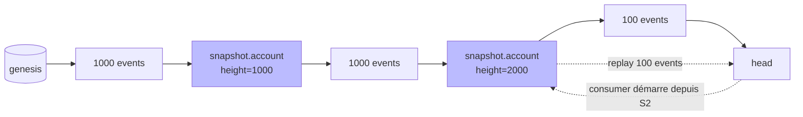

# Snapshots et compaction logique

## Problème

Pour reconstruire l'état d'un agrégat (un compte, un panier…) à partir du journal, un consommateur doit **rejouer tous les événements** depuis le genesis. À 10 millions d'événements, démarrer un service ou rebuild un read model prend plusieurs minutes — voire des heures si chaque event implique une logique métier.

Le journal lui-même reste append-only — pas question de supprimer ou agréger les vieux events. Mais on peut éviter de tout rejouer.

## Options et tradeoffs

| Option | Idée | Impact chaîne | Complexité |
|---|---|---|---|
| **Pas de snapshot** | Rejouer tout à chaque démarrage | Aucun | Triviale, mais O(n) |
| **Snapshots externes** | Fichier `.snapshot` à côté du `.db` | Aucun | Pas auditable |
| **Snapshots dans la chaîne** | Événement `snapshot{aggregate_id, state_hash, height}` | Additif | Auditable, signé, versionné |
| **Compaction de log** (Kafka-style) | Supprimer les events obsolètes, garder le dernier par clé | **Casse l'append-only** | Inadapté ici |

## Recommandation

**Snapshots dans la chaîne** comme événements de type `snapshot.*` :

- attestés par le quorum comme n'importe quel événement → on peut faire confiance au snapshot ;
- portent un `state_hash` (hash déterministe de l'état projeté) → un consommateur peut vérifier qu'il calcule la même chose ;
- portent une `height` (id du dernier event inclus) → on sait depuis où rejouer.

Un consommateur démarre alors :

1. lit le **dernier `snapshot` valide** pour son agrégat ;
2. charge l'état persisté depuis ce snapshot (hors-chaîne, ex. dans un KV) ;
3. rejoue uniquement les events `id > height` du snapshot.



## Schéma proposé

Émission périodique (tâche planifiée ou déclenchée par seuil) :

```python
def emit_snapshot(client, aggregate_id, state):
    state_bytes = canonical_json(state)
    state_hash = hashlib.sha256(state_bytes).hexdigest()
    return client.prepare(
        event_type="snapshot.account",
        payload={
            "aggregate_id": aggregate_id,
            "snapshot_format_version": 1,
            "height": store.height(),  # id de référence
            "state_hash": state_hash,
            "state_uri": "s3://snapshots/account/42/2026-05-10.json",  # hors-chaîne
        },
    )
```

Le **state lui-même** vit hors-chaîne (S3, GCS, fichier local) car il peut être volumineux. Le `state_hash` est l'ancre de confiance — un consommateur télécharge le state, recalcule le hash, et abandonne s'il ne correspond pas.

Lecture :

```python
def load_with_snapshot(consumer, aggregate_id):
    snap = store.last_snapshot_for(aggregate_id)
    if snap:
        state = fetch(snap.payload["state_uri"])
        assert sha256(state) == snap.payload["state_hash"]
        for ev in store.read_after(snap.payload["height"]):
            state = apply(state, ev)
        return state
    return rebuild_from_zero()
```

## Intégration au store actuel

- **Aucune modification du core**. Les snapshots sont des events ordinaires.
- **Helper optionnel** dans [event_store/store.py](../../event_store/store.py) : `read_after(row_id)` pour démarrer après un snapshot.
- **Stockage du state** : à confier à un object store. Le journal ne s'occupe que des hash et URIs.
- **Politique de fréquence** : par défaut, un snapshot tous les N=10000 events ou toutes les T=24h, selon ce qui arrive en premier.

## Limites / risques

- **Snapshot corrompu / disponibilité** : si le state hors-chaîne est perdu, on retombe sur un rebuild from zero. Garder ≥ 2 snapshots côte à côte par agrégat.
- **Versioning du state** : le format du state évolue avec le code. Inclure un `snapshot_format_version` et appliquer les mêmes règles que pour [EVENT_VERSIONING.md](EVENT_VERSIONING.md).
- **Déterminisme** : pour que `state_hash` soit auditable, la projection (`apply(state, event)`) **doit être déterministe** — pas d'horloge, pas d'aléatoire, pas de side-effect. Un test dédié à cela.
- **Snapshot frauduleux** : un quorum compromis peut signer un snapshot qui ne correspond pas à l'état réel. Mitigation : un consommateur peut **toujours** ignorer les snapshots et rejouer tout (mode debug / audit).
- **Privacy & PII** : le state peut contenir des PII. Si crypto-shredding est en place ([GDPR_CRYPTO_SHREDDING.md](GDPR_CRYPTO_SHREDDING.md)), le snapshot doit aussi être chiffré et participer à l'effacement.

## Voir aussi

- [EVENT_VERSIONING.md](EVENT_VERSIONING.md) — versionner aussi le format du state
- [GDPR_CRYPTO_SHREDDING.md](GDPR_CRYPTO_SHREDDING.md) — l'état projeté doit suivre l'effacement
- [CONSUMER_OFFSETS.md](../distribution/CONSUMER_OFFSETS.md) — un consommateur démarre depuis un snapshot
- [COLD_ARCHIVE.md](../operations/COLD_ARCHIVE.md) — un snapshot consolidé permet d'archiver plus agressivement
