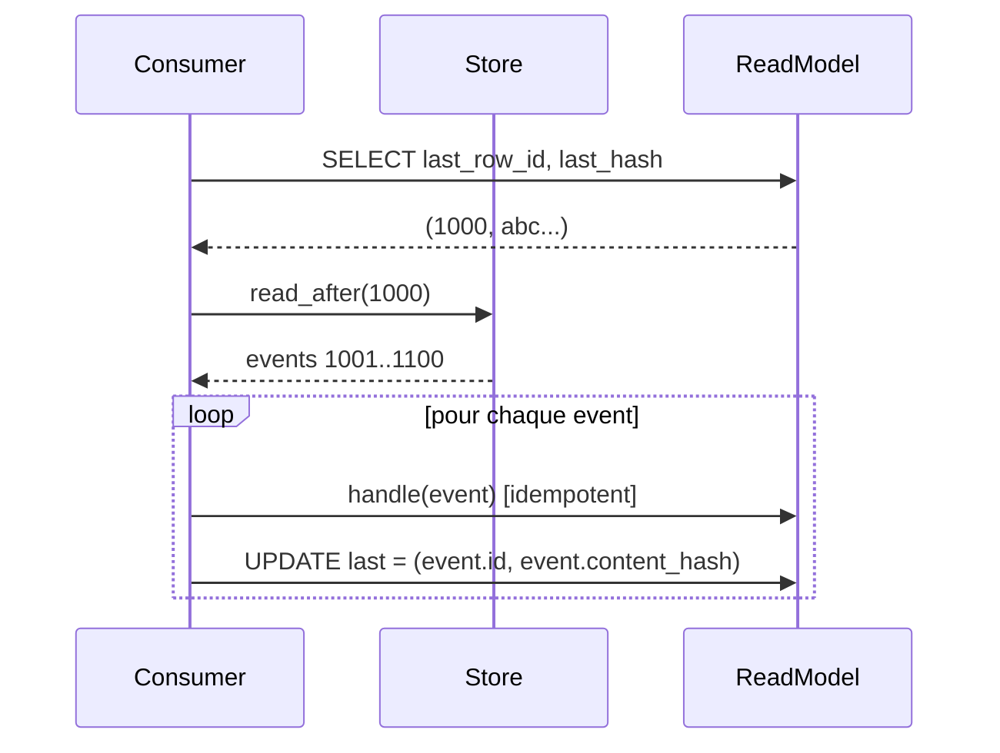

# Consumer offsets et exactly-once

## Problème

Un consommateur (projection, dashboard, intégration externe) qui plante doit **reprendre où il s'est arrêté**. Sans suivi d'offset :

- redémarrer = rejouer tout depuis le début (coûteux) ;
- ne pas redémarrer = perdre les events arrivés pendant la panne ;
- redémarrer en sautant des events (par ex. en se basant sur l'horloge système) = inconsistance silencieuse.

Le store actuel n'expose qu'un `id` croissant côté `events` — c'est suffisant pour piloter un offset, mais aucune convention n'est en place.

## Options et tradeoffs

| Option | Idée | Garantie | Coût |
|---|---|---|---|
| **Pas d'offset** | Recommencer à zéro | Replay complet | O(n) |
| **Offset simple** (`row_id`) | Stocker `last_processed_id` | At-least-once | Faible |
| **Offset + idempotence** | `row_id` + handler idempotent | Exactly-once effectif | Faible côté offset, fort côté handler |
| **Two-phase commit** | Transaction qui couple update du read model et update de l'offset | Exactly-once strict | Moyenne, nécessite XA ou base partagée |
| **Offset + content_hash** | Le hash valide qu'on ne saute pas un event | Détecte les corruptions / sauts | Légère vérification |

## Recommandation

**Offset = `(last_row_id, last_content_hash)` + handlers idempotents**.

- Le `row_id` donne la position ;
- Le `content_hash` valide qu'on lit bien la même chose qu'on a vu la dernière fois (détecte une corruption, un fork, une re-base) ;
- L'idempotence côté handler garantit l'exactly-once *effectif* sans 2PC (un event rejoué ne change pas l'état).



## Schéma proposé

Table `consumer_offsets` (dans la base du consommateur, **pas** dans `events`) :

```sql
CREATE TABLE consumer_offsets (
    consumer_name   TEXT PRIMARY KEY,
    last_row_id     INTEGER NOT NULL,
    last_content_hash TEXT NOT NULL,
    updated_at      REAL NOT NULL
);
```

Boucle de consommation :

```python
class Consumer:
    def __init__(self, name, store, handler):
        self.name = name
        self.store = store
        self.handler = handler  # doit être idempotent

    def step(self):
        last = self._load_offset()
        for ev in self.store.read_after(last.row_id):
            # Sanity check : si on attend un parent précis, vérifier
            if last.row_id > 0 and ev.id == last.row_id + 1:
                # OK
                pass
            self.handler(ev)               # idempotent
            self._save_offset(ev.id, ev.content_hash)

    def _load_offset(self) -> Offset:
        ...

    def _save_offset(self, row_id, content_hash):
        # Idéalement dans la même transaction que la mise à jour du read model.
        ...
```

## Intégration au store actuel

- **Helper utile** : ajouter `read_after(row_id: int)` dans [event_store/store.py](../../event_store/store.py). Trivial — `WHERE id > ?`.
- **Pas de table d'offset dans le store** — chaque consommateur gère son offset dans son propre stockage (cohésion).
- **Atomicité** : pour un consommateur SQLite (read model + offset dans le même fichier), un seul `BEGIN; ...; COMMIT;` couvre les deux. Pour des stockages séparés, voir « limites » ci-dessous.

## Limites / risques

- **Pas de 2PC entre stores hétérogènes** : si le read model est dans Postgres et l'offset dans Redis, la cohérence n'est qu'eventuelle. Pattern « *outbox* » : commit le read model **et** l'offset dans le même store, dériver les notifications à l'extérieur via un autre consommateur.
- **Idempotence indispensable** : un handler qui incrémente un compteur sans clé de dédup va doubler à chaque crash. Toute mutation doit être protégée par un `INSERT ... ON CONFLICT DO NOTHING` ou un `processed_events(content_hash)`.
- **Détection de fork** ([FORKS.md](FORKS.md)) : si la chaîne fork et que le consommateur reprend après le fork, le `content_hash` à `row_id` peut différer. Politique : alerter et stopper plutôt que continuer aveuglément.
- **Compaction / archivage** ([COLD_ARCHIVE.md](../operations/COLD_ARCHIVE.md)) : si les events anciens sont déplacés dans une archive, `read_after(low_id)` doit savoir aller chercher dans l'archive. Sinon, l'offset devient invalide quand un event archivé est demandé.
- **Performance** : un consommateur lent peut accumuler du retard. Métrique à surveiller : `head.id - consumer.last_row_id`.

## Voir aussi

- [FORKS.md](FORKS.md) — politique en cas de fork
- [COLD_ARCHIVE.md](../operations/COLD_ARCHIVE.md) — replay traversant les archives
- [SNAPSHOTS.md](../data/SNAPSHOTS.md) — démarrage depuis un snapshot pour éviter le replay total
- [WATERMARKS.md](WATERMARKS.md) — offset borné par le watermark
- [SHARDING.md](../scale/SHARDING.md) — un offset par shard
