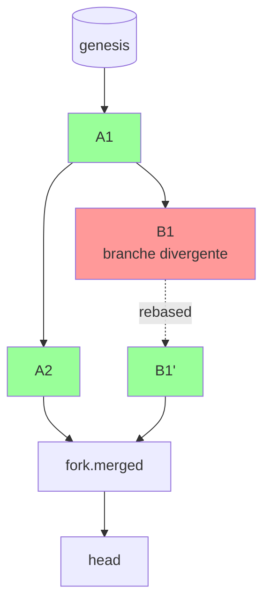

# Forks et réconciliation de divergence

## Problème

Dans un déploiement multi-machines avec partition réseau, deux sous-réseaux de pairs peuvent commit en parallèle sur **leur propre copie** de la base. Quand la partition se résout, on a deux têtes de chaîne distinctes — un *fork*.

Le store actuel ([event_store/store.py](../../event_store/store.py)) repose sur un fichier SQLite unique avec `BEGIN EXCLUSIVE` ; il ne sait pas gérer plusieurs têtes. Conséquences :

- les nonces des émetteurs ont avancé des deux côtés indépendamment → collisions ;
- les `parent_hashes` divergent → impossible de fusionner directement ;
- aucun consommateur ne sait laquelle des deux versions est la « vraie ».

## Options et tradeoffs

| Option | Idée | Disponibilité | Cohérence |
|---|---|---|---|
| **Refuser les forks** (CP) | Une seule chaîne, un seul leader, refuse les commits en partition | Indisponible si partition | Cohérence forte |
| **Accepter et choisir** (AP) | Les deux côtés commitent ; au merge, une règle déterministe sélectionne le winner | Toujours disponible | Cohérence éventuelle |
| **Vector clock + merge** | Maintenir un graphe de divergence ; les deux branches restent valides | Toujours disponible | Cohérence partielle, complexité forte |
| **Manuel** | Un opérateur tranche le fork avec un événement signé | Indisponible pendant la résolution | Cohérence forte une fois tranchée |

## Recommandation

**AP avec règle de tie-break déterministe** :

1. les deux côtés acceptent leurs propres commits pendant la partition ;
2. au merge, on émet un événement `fork.detected{branch_a_head, branch_b_head}` puis `fork.merged{winner_head, loser_head, rebased_events}` ;
3. la règle de tie-break est explicite et signée par un quorum (ex. *« la branche avec le plus d'events distincts gagne ; égalité → ordre lexicographique des row_hash »*) ;
4. les events de la branche perdante sont **re-commitées** sur la branche gagnante (re-signature requise car les `parent_hashes` changent) ; les nonces sont décalés.



## Schéma proposé

Détection :

```python
def detect_fork(local_store, remote_store) -> Optional[ForkInfo]:
    """Compare les têtes ; remonte jusqu'au dernier ancêtre commun."""
    local_head = local_store.height()
    remote_head = remote_store.height()
    common = find_common_ancestor(local_store, remote_store)
    if common is None or common.id < min(local_head, remote_head):
        return ForkInfo(local_head, remote_head, common)
    return None
```

Merge :

```python
def merge_fork(winner: SQLEventStore, loser: SQLEventStore, fork: ForkInfo):
    # 1. Émettre fork.detected sur le winner
    admin.prepare(
        event_type="fork.detected",
        payload={
            "winner_head": winner.head_hash(),
            "loser_head": loser.head_hash(),
            "common_ancestor_id": fork.common.id,
        },
    )
    # 2. Re-jouer les events du loser sur le winner (re-signature requise)
    for ev in loser.read_after(fork.common.id):
        # Demander à l'émetteur original de re-signer avec les nouveaux parents.
        # Sinon : événement marqué comme orphelin et journalisé.
        ...
    # 3. Émettre fork.merged
    admin.prepare(
        event_type="fork.merged",
        payload={
            "winner_head": winner.head_hash(),
            "loser_head": loser.head_hash(),
            "rebased_count": k,
            "tie_break_rule": "longest-then-lex",
        },
    )
```

## Intégration au store actuel

- **Pas dans le core** — le store reste single-database. Le fork management est un module au-dessus.
- **Pré-requis** : un mécanisme de réplication (qui n'existe pas) entre les pairs, pour comparer les têtes. Cf. [WATERMARKS.md](WATERMARKS.md).
- **Re-signature** : impossible si l'émetteur original n'est plus disponible. Politique : événement orphelin → consigné dans un journal externe pour audit, **non** rejoint à la chaîne.

## Limites / risques

- **Re-signature obligatoire** : changer les `parent_hashes` change le `row_hash`, mais comme les signatures portent sur `content_hash` (qui ne dépend pas des parents), elles restent valides. Donc **pas besoin de re-signer** côté émetteur ! Bon point de design héritage de l'invariant 1 ([CLAUDE.md](../../CLAUDE.md)).
- **Conflit de nonces** : si alice a émis (nonce=42) sur les deux branches, on ne peut garder qu'un des deux events. L'autre est rejeté ou réémis avec un nouveau nonce — choix politique.
- **Determinisme du tie-break** : tous les pairs doivent appliquer la même règle. Une règle ambiguë génère des merges divergents → fork récursif. Tester unitairement.
- **Coût** : une partition longue avec beaucoup d'events des deux côtés → merge coûteux et histoire compliquée à auditer. Préférer une architecture qui évite les partitions (CP) si la durée acceptable d'indisponibilité le permet.
- **Cas dégénéré** : trois branches simultanées. Le mécanisme se généralise mais devient cauchemardesque. En pratique, prévoir un *single primary* qui tranche.
