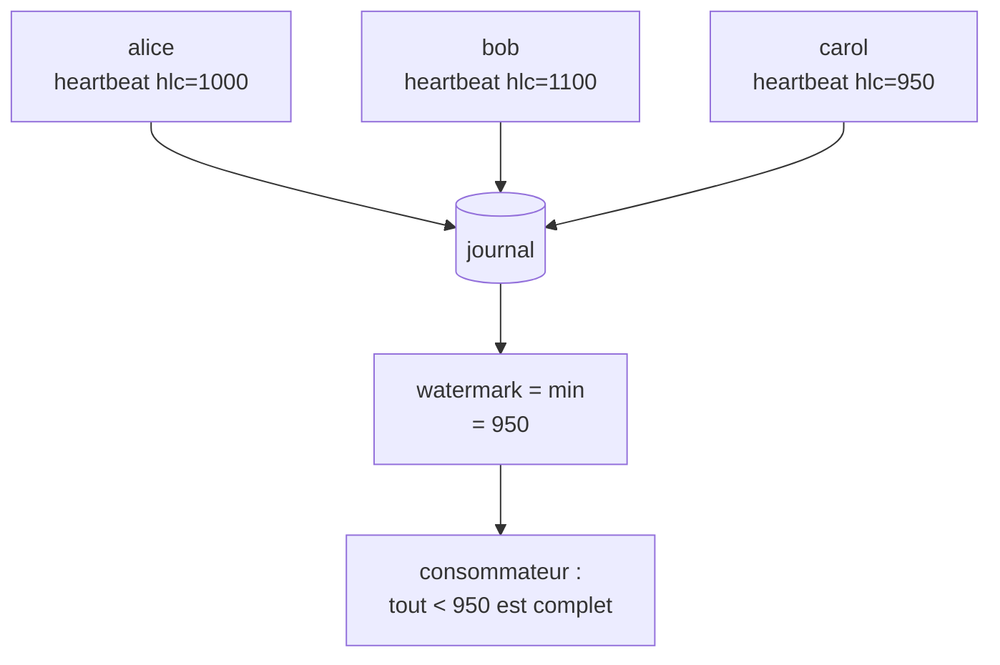

# Watermarks et complétude temporelle

## Problème

Un consommateur ne sait pas quand il a *« tout vu jusqu'au temps T »*. Concrètement :

- un event d'alice avec `hlc_physical_ms=1000` peut arriver **après** un event de bob avec `hlc_physical_ms=2000` (transport lent, pair temporairement absent) ;
- le consommateur ne peut pas conclure « j'ai tout pour la fenêtre [0, 1500] » car alice pourrait encore commiter un event antérieur à 1500 ;
- les agrégations temporelles (« somme des dépôts de la journée ») risquent de manquer des entrées tardives.

C'est un problème classique de stream processing : on a besoin d'un **watermark** — une garantie qu'aucun event sous le watermark n'arrivera plus.

## Options et tradeoffs

| Option | Idée | Latence | Risque |
|---|---|---|---|
| **Watermark fixe** (Δt) | Considérer T-Δt comme garanti | Δt configurable | Si un pair est en retard de Δt+1, on rate des events |
| **Heartbeats** | Chaque pair émet périodiquement un event `heartbeat{ts}` ; le watermark = `min(last_heartbeat[pair])` | Adaptative | Heartbeat perdu = watermark bloqué |
| **Watermark explicite** | Un coordonnateur émet `watermark{ts}` après synchronisation | Forte | Centralisation |
| **Aucun watermark** | Le consommateur traite ce qu'il a et corrige rétrospectivement | Aucune | Erreurs persistantes en aval |

## Recommandation

**Heartbeats par pair** : chaque pair émet un événement `heartbeat{}` toutes les T=10s, **même s'il n'a rien d'autre à dire**. Le watermark est simplement `min(dernier heartbeat de chaque pair attendu)`.

Avantages :

- pas de coordonnateur, pas de SPOF ;
- détection automatique de pair en panne (son heartbeat ne progresse plus) ;
- compatible avec le quorum (un heartbeat est un event ordinaire, attesté).



## Schéma proposé

Émission périodique côté chaque pair :

```python
async def heartbeat_loop(client, interval_s=10):
    while True:
        try:
            prepared = client.prepare(
                event_type="heartbeat",
                payload={},  # pas besoin de contenu — l'HLC fait le job
            )
            collect_quorum_and_commit(prepared)
        except Exception as exc:
            log.warning("heartbeat failed: %s", exc)
        await asyncio.sleep(interval_s)
```

Calcul du watermark côté consommateur :

```python
def compute_watermark(events) -> int:
    """Watermark = min des derniers heartbeats par pair attendu."""
    last_hb = {}
    for ev in events:
        if ev.event_type == "heartbeat":
            last_hb[ev.issuer_id] = max(
                last_hb.get(ev.issuer_id, 0), ev.hlc_physical_ms
            )
    expected_peers = {"alice", "bob", "carol"}
    if not expected_peers.issubset(last_hb):
        return 0  # un pair n'a jamais émis : pas de garantie
    return min(last_hb[p] for p in expected_peers)
```

## Intégration au store actuel

- **Aucune modification du core** — `heartbeat` est un event ordinaire signé/attesté.
- **Helper optionnel** : `store.compute_watermark(expected_peers: set[str]) -> int` qui parcourt les heartbeats récents.
- **Cron / scheduler** : chaque pair lance un `heartbeat_loop` au démarrage.
- **Coût** : N pairs × 1 event toutes les 10s = N/10 events/s « vides ». Négligeable, mais suit la croissance de N.

## Limites / risques

- **Pair temporairement absent** : son heartbeat ne progresse plus → watermark bloqué pour tout le monde. Politique : seuil de timeout (ex. 60s sans heartbeat) au-delà duquel le pair est exclu du calcul du watermark, jusqu'à ce qu'il revienne. À journaliser (`peer.unhealthy{peer_id}`).
- **Choix de l'intervalle** : trop court → bruit ; trop long → latence d'agrégation. Un compromis raisonnable est 10s pour des fenêtres minute, 60s pour des fenêtres heure.
- **Heartbeats contre-productifs** : si le pair est complètement isolé, ses heartbeats ne traversent pas le quorum et ne sont jamais commités → invisible côté consommateur. Mitigation : monitoring externe ([OBSERVABILITY.md](../operations/OBSERVABILITY.md)).
- **HLC vs wall clock** : le watermark est en HLC `physical_ms`, qui peut diverger légèrement du temps réel. Pour des fenêtres temporelles strictes (par ex. comptable), préférer `created_at` (wall clock) avec ses propres compromis.
- **Interaction avec correlation_id** ([CORRELATION.md](../../CORRELATION.md)) : le watermark dit *« plus rien d'antérieur n'arrivera »* mais ne dit pas *« le groupe X est complet »*. Les deux mécanismes sont complémentaires.

## Voir aussi

- [CORRELATION.md](../../CORRELATION.md) — mécanisme complémentaire de groupement
- [OBSERVABILITY.md](../operations/OBSERVABILITY.md) — alerte sur pair silencieux
- [CONSUMER_OFFSETS.md](CONSUMER_OFFSETS.md) — offset borné par le watermark
- [FORKS.md](FORKS.md) — watermark stallé peut révéler une partition
