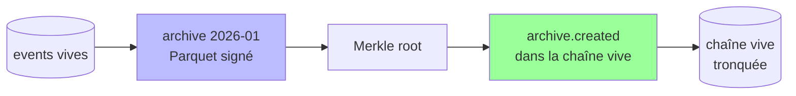

# Archivage froid

## Problème

La chaîne grossit indéfiniment : append-only par construction, jamais de purge. À 100 events/seconde, c'est ~3 milliards/an. Conséquences :

- le fichier `.db` enfle au-delà du raisonnable (plusieurs To après quelques années) ;
- les sauvegardes complètes deviennent prohibitives ;
- les requêtes sur la table `events` ralentissent ;
- la mémoire WAL et les caches se dégradent.

Or on ne peut pas supprimer — c'est tout l'intérêt du journal.

## Options et tradeoffs

| Option | Idée | Auditabilité | Migration |
|---|---|---|---|
| **Tout garder en chaud** | Aucun archivage | Maximale | Aucune |
| **VACUUM périodique** | Compacter le fichier SQLite | Inchangée | Faible |
| **Archive externe** (cold) | Déplacer les vieilles tranches dans des fichiers Parquet/CSV signés ; garder une référence dans la chaîne vive | Préservée si le manifest est ancré | Moyenne |
| **Réplication append-only sur stockage objet** | Chaque event est répliqué dans S3 ; le `.db` peut être tronqué | Requiert le stockage objet pour l'audit | Forte |
| **Sharding temporel** | Une chaîne par mois ; ancrage de la chaîne du mois M dans la chaîne maître | Préservée | Moyenne, similaire à [SHARDING.md](../scale/SHARDING.md) |

## Recommandation

**Archive externe + ancrage dans la chaîne vive**.

1. Périodiquement (ex. une fois par mois), exporter une tranche `[id_min, id_max]` dans un fichier Parquet ou JSON-Lines, signé par un quorum d'auditeurs.
2. Calculer un Merkle root de la tranche → l'inclure dans un événement `archive.created` commité dans la chaîne vive.
3. Supprimer la tranche de la table `events` (uniquement après vérification du fichier d'archive et de sa Merkle).

Pour l'audit, `verify_integrity()` sait :

- soit que l'event existe dans la table → vérifier directement ;
- soit qu'il est dans une archive référencée → ouvrir l'archive et vérifier le Merkle.



## Schéma proposé

Événement d'ancrage :

```json
{
  "event_type": "archive.created",
  "payload": {
    "archive_format_version": 1,
    "id_min": 1,
    "id_max": 1000000,
    "row_count": 1000000,
    "merkle_root": "abc123...",
    "uri": "s3://eventstore-archives/2026-01.parquet",
    "size_bytes": 12345678,
    "created_at": 1730000000
  }
}
```

Procédure :

```python
def archive_range(store, id_min, id_max, archive_path):
    rows = list(store.read_range(id_min, id_max))
    write_parquet(archive_path, rows)
    merkle = merkle_root([r.row_hash for r in rows])
    # Émettre archive.created via le quorum d'auditeurs
    admin_client.prepare(
        event_type="archive.created",
        payload={
            "id_min": id_min, "id_max": id_max,
            "row_count": len(rows),
            "merkle_root": merkle,
            "uri": archive_path,
        },
    )
    # Une fois engagé : supprimer les rows ARCHIVÉS de la base vive
    # ATTENTION : nécessite de désactiver temporairement le trigger.
    # Mieux : DETACH la base et la garder en read-only ailleurs.
```

## Intégration au store actuel

- **Helper** : `read_range(id_min, id_max)` dans [event_store/store.py](../../event_store/store.py).
- **Suppression** : c'est le seul cas où on touche à l'append-only. Politique stricte :
  - les events archivés sont **migrés**, pas perdus ;
  - le retrait est validé par un événement `archive.created` engagé **avant** ;
  - les triggers sont désactivés *uniquement* dans la fenêtre d'archivage, sous verrou exclusif.
- **Audit** : `verify_integrity()` doit consulter les archives référencées. Un module `archive_resolver` qui matérialise les events archivés à la volée.

## Limites / risques

- **Brèche dans l'append-only** : la procédure d'archivage est, par nature, une exception à l'invariant. C'est le moment le plus dangereux du cycle de vie. À automatiser, journaliser, et auditer indépendamment.
- **Disponibilité de l'archive** : si le S3 est inaccessible, `verify_integrity()` ne peut plus rien prouver pour la tranche archivée. Garder ≥ 2 copies (S3 + bucket de redondance + tape long-terme).
- **Format pérenne** : Parquet et JSON-Lines sont raisonnables sur 10 ans, douteux sur 50. Pour les obligations légales > 30 ans, prévoir une re-encapsulation périodique avec re-signature.
- **Liens cross-archives** : un consommateur ([CONSUMER_OFFSETS.md](../distribution/CONSUMER_OFFSETS.md)) qui veut rejouer depuis un id ancien doit traverser plusieurs archives. Indexer les archives (`archive_index.csv`) pour retrouver rapidement.
- **Cohérence avec snapshots** ([../data/SNAPSHOTS.md](../data/SNAPSHOTS.md)) : un consommateur qui repart d'un snapshot postérieur à toutes les archives n'a pas besoin de remonter aux archives. Ne archive que ce qui est avant le dernier snapshot consolidé.

## Voir aussi

- [SHARDING.md](../scale/SHARDING.md) — sharding temporel comme alternative
- [CONSUMER_OFFSETS.md](../distribution/CONSUMER_OFFSETS.md) — replay cross-archive
- [SNAPSHOTS.md](../data/SNAPSHOTS.md) — n'archiver qu'en aval du dernier snapshot
- [INCREMENTAL_AUDIT.md](../security/INCREMENTAL_AUDIT.md) — l'audit doit consulter les archives
- [GDPR_CRYPTO_SHREDDING.md](../data/GDPR_CRYPTO_SHREDDING.md) — politique d'effacement étendue aux archives
