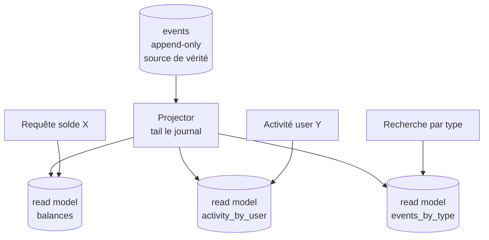

# Index secondaires et read models

## Problème

Aujourd'hui le store offre deux ordres de lecture (`read_all`, `read_in_emission_order` dans [event_store/store.py](../../event_store/store.py)) — toujours **toute la chaîne**. Pour répondre à des questions métier comme :

- *« quels sont les événements du compte ACC-001 ? »*
- *« quels événements de type `deposit.made` après hier ? »*
- *« quel est le solde courant du compte X ? »*

… il faut **scanner toute la chaîne** et filtrer en mémoire. C'est O(n) à chaque requête.

## Options et tradeoffs

| Option | Idée | Coût écriture | Coût requête |
|---|---|---|---|
| **Scan + filtre** | Statu quo | Aucun | O(n) |
| **Index SQL natifs** | `CREATE INDEX ON events(event_type, hlc_physical_ms)` | Faible | O(log n) sur les colonnes indexées |
| **Index extraits du payload** | Colonnes dérivées + index (`account_id`, `amount`…) | Schéma rigide | Très rapide |
| **Read models / projections** (CQRS) | Tables dédiées peuplées par un consommateur | Coût asynchrone | Très rapide, modélisation libre |
| **Moteur de recherche externe** | Indexer dans Elasticsearch, OpenSearch | Pipeline | Très flexible |

## Recommandation

**Read models en CQRS**, peuplés par un consommateur dédié.

- Les events restent la **source de vérité** (write model immuable).
- Chaque read model est une **table dérivée** dans une base mutable, optimisée pour ses requêtes.
- Un read model peut être détruit et reconstruit à tout moment depuis la chaîne — la cohérence finale est garantie par le replay déterministe.

Pour les besoins très simples (filtre par `event_type`, par `issuer_id`), un **index SQL natif** sur `events` suffit et évite la complexité CQRS.



## Schéma proposé

### Index SQL légers

Déjà partiellement présent ([event_store/schema.py](../../event_store/schema.py)) :

```sql
CREATE INDEX idx_events_issuer_nonce ON events(issuer_id, nonce);
CREATE INDEX idx_events_hlc ON events(hlc_physical_ms, hlc_logical);
-- À ajouter selon les requêtes :
CREATE INDEX idx_events_type ON events(event_type);
CREATE INDEX idx_events_created ON events(created_at);
```

### Projector minimal

```python
class BalanceProjector:
    """Maintient un read model `balances(account_id, balance_cents)`."""

    def __init__(self, db_path):
        self.conn = sqlite3.connect(db_path)
        self.conn.execute("CREATE TABLE IF NOT EXISTS balances(account_id TEXT PRIMARY KEY, balance_cents INTEGER)")
        self.conn.execute("CREATE TABLE IF NOT EXISTS projector_state(name TEXT PRIMARY KEY, last_row_id INTEGER)")

    def project(self, store):
        last = self.conn.execute(
            "SELECT last_row_id FROM projector_state WHERE name='balance'"
        ).fetchone()
        last_id = last[0] if last else 0
        for ev in store.read_after(last_id):
            self._apply(ev)
            self._save_position(ev.id)

    def _apply(self, ev):
        if ev.event_type == "deposit.made":
            account = ev.payload["account"]
            amount = ev.payload["amount_cents"]
            self.conn.execute(
                "INSERT INTO balances(account_id, balance_cents) VALUES (?, ?) "
                "ON CONFLICT(account_id) DO UPDATE SET balance_cents = balance_cents + ?",
                (account, amount, amount),
            )
```

## Intégration au store actuel

- **Index SQL** : ajout dans `schema.py`, idempotent (`IF NOT EXISTS`).
- **Read models** : code séparé, base SQLite distincte (`balances.db`, `activity.db`…). Le journal n'a aucune référence vers les read models.
- **Reset** : pour reconstruire un read model, supprimer la base dérivée et relancer le projector — il rejoue depuis l'event 1.
- **Cohérence** : eventuelle. Pas de transaction cross-base. Acceptable pour 99 % des read models (dashboard, query métier). Pour la cohérence forte, faire la projection synchrone (au coût de la latence).

## Limites / risques

- **Drift** : si un projector boggue, son read model diverge. Garder un test périodique de réconciliation (rebuild from scratch en parallèle, comparer avec l'incrémental).
- **Multi-projector** : chaque projector a son propre offset. Pas de synchronisation entre projectors — ils peuvent être en retard l'un par rapport à l'autre.
- **Index sur payload** : les colonnes dérivées (extraire `account_id` du JSON dans une colonne indexée) sont **plus performantes** mais introduisent un couplage : changer la forme du payload casse l'index. Préférer les read models pour les besoins évolutifs.
- **Sharding** ([SHARDING.md](SHARDING.md)) : un projector consomme N shards en parallèle. La cohérence cross-shard nécessite un point d'ancrage (chaîne maîtresse).
- **Confidentialité** : un read model en clair contourne l'envelope encryption ([PAYLOAD_ENCRYPTION.md](../security/PAYLOAD_ENCRYPTION.md)). Le projector doit déchiffrer avec autorisation, et le read model doit avoir le même niveau de protection que les données projetées.
