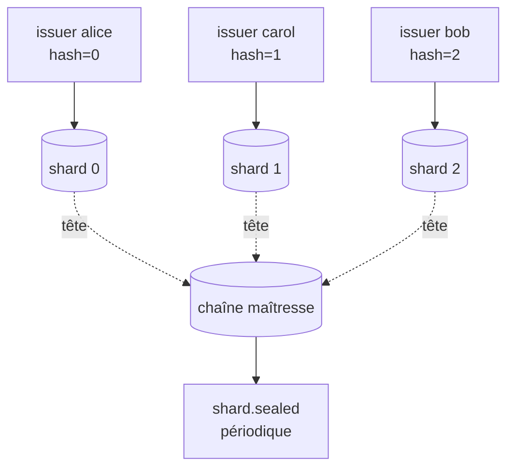

# Sharding par émetteur

## Problème

Aujourd'hui, `commit()` ([event_store/store.py:367](../../event_store/store.py#L367)) prend un verrou Python (`_write_lock`) **et** ouvre une transaction `BEGIN EXCLUSIVE` SQLite. Conséquence : **un seul commit en cours à la fois** pour tout le système.

Avec Ed25519 verifications, validations cryptographiques et fsync WAL, on plafonne typiquement à 100–500 commits/seconde sur du matériel courant. À 10 émetteurs très actifs, on devient le goulot d'étranglement.

## Options et tradeoffs

| Option | Idée | Garantie d'ordre | Complexité |
|---|---|---|---|
| **Statu quo** | Une chaîne globale, sérialisée | Total order strict | Triviale, plafonnée |
| **Une chaîne par émetteur** | Chaque émetteur a son propre fichier `.db` | Order partiel ; pas de cross-issuer ordering | Forte fragmentation |
| **Sharding par hash(issuer_id)** | N chaînes, l'émetteur va dans son shard ; un événement de scellement périodique relie les shards | Order partiel, points de synchronisation explicites | Moyenne |
| **Single chain + commit_batch** | Garder une chaîne mais batcher les commits | Total order, un seul fsync par batch | Faible, gain ×10 typique |

## Recommandation

**Étape 1 — `commit_batch`** : déjà implémenté dans [event_store/store.py:371](../../event_store/store.py#L371). Encourager les émetteurs à grouper. Pas de changement de schéma, gain immédiat.

**Étape 2 (si besoin) — sharding par bucket** : N chaînes parallèles (N = 4 ou 8), bucket = `hash(issuer_id) % N`. Un événement périodique `shard.sealed{shard_id, head_hash, ts}` est commité dans une **chaîne maîtresse** pour offrir un point d'ordre global.



## Schéma proposé

```python
class ShardedEventStore:
    def __init__(self, shard_paths: list[str], master_path: str, **kw):
        self.shards = [SQLEventStore(p, **kw) for p in shard_paths]
        self.master = SQLEventStore(master_path, **kw)

    def shard_for(self, issuer_id: str) -> SQLEventStore:
        idx = int(hashlib.sha256(issuer_id.encode()).hexdigest(), 16) % len(self.shards)
        return self.shards[idx]

    def commit(self, prepared):
        return self.shard_for(prepared.issuer_id).commit(prepared)

    def seal_shards(self):
        """À appeler périodiquement (cron) pour ancrer les shards."""
        for i, shard in enumerate(self.shards):
            head = shard._head_parents_snapshot()[0]
            self.master_client.prepare(
                event_type="shard.sealed",
                payload={"shard_id": i, "head_hash": head, "ts": time.time()},
            )
            # ... commit avec quorum
```

## Intégration au store actuel

- **Étape 1** : utilisation de `commit_batch()` côté client, déjà en place.
- **Étape 2** : nouveau module `event_store/sharded.py` qui orchestre N `SQLEventStore`. Le code des stores individuels est inchangé.
- **Audit** : `verify_integrity()` tourne sur chaque shard indépendamment. Un audit cross-shard rejoue la chaîne maîtresse pour vérifier que chaque `shard.sealed` correspond à la tête réelle du shard à ce moment.

## Limites / risques

- **Pas d'order total entre shards** : si l'application a besoin de sérialiser strictement deux events de pairs différents, le sharding ne convient pas. Soit garder un seul shard, soit gérer la causalité via `correlation_id` ([CORRELATION.md](../../CORRELATION.md)).
- **Rebalancing** : si on change N (4 → 8), les anciens events restent dans leur ancien shard ; les nouveaux vont dans la nouvelle distribution. Pas de migration des données — on accepte la fragmentation.
- **Quorum cross-shard** : si les pairs sont eux-mêmes shardés (pair X attestant uniquement les events du shard 0), un attaquant peut concentrer son attaque sur un shard avec peu de pairs. Garder les pairs **partagés** entre tous les shards.
- **Backup et restore** : multipliés par N. Tooling à adapter ([CLI.md](../operations/CLI.md)).
- **Coût SQLite** : N fichiers WAL ouverts simultanément, N fsync par cycle de seal. Si N > 8, considérer un vrai SGBD (PostgreSQL avec table partitionnée).
