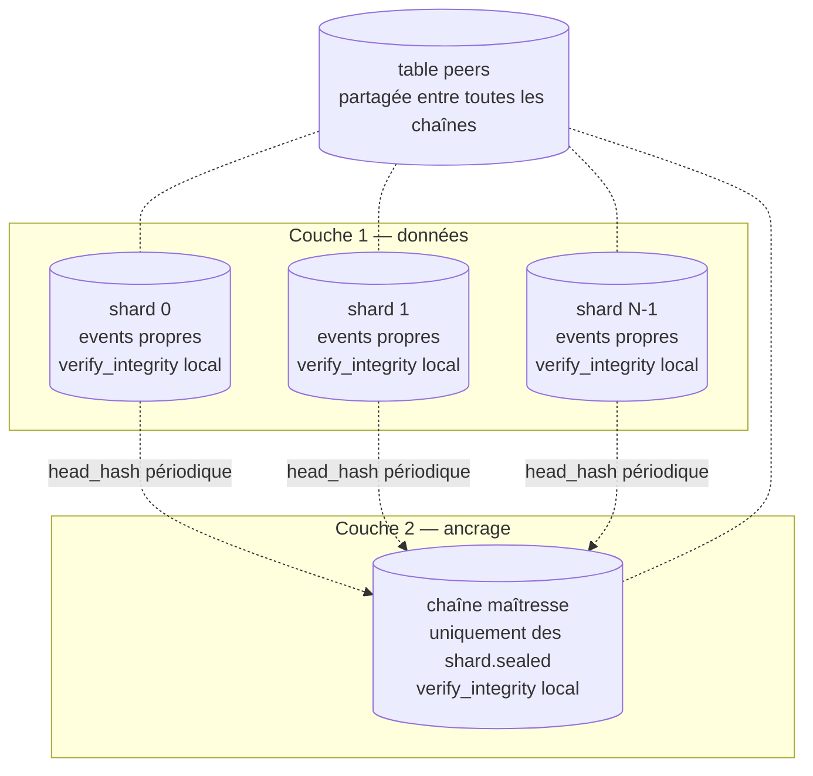

# Sharding par émetteur

## Problème

Aujourd'hui, `commit()` ([event_store/store.py:367](../../event_store/store.py#L367)) prend un verrou Python (`_write_lock`) **et** ouvre une transaction `BEGIN EXCLUSIVE` SQLite. Conséquence : **un seul commit en cours à la fois** pour tout le système.

Avec Ed25519 verifications, validations cryptographiques et fsync WAL, on plafonne typiquement à 100–500 commits/seconde sur du matériel courant. À 10 émetteurs très actifs, on devient le goulot d'étranglement.

## Options et tradeoffs

| Option | Idée | Garantie d'ordre | Complexité |
|---|---|---|---|
| **Statu quo** | Une chaîne globale, sérialisée | Total order strict | Triviale, plafonnée |
| **Une chaîne par émetteur** | Chaque émetteur a son propre fichier `.db` | Order partiel ; pas de cross-issuer ordering | Forte fragmentation |
| **Sharding par hash(issuer_id)** | N chaînes, l'émetteur va dans son shard ; un événement de scellement périodique relie les shards | Order partiel, points de synchronisation explicites | Moyenne |
| **Single chain + commit_batch** | Garder une chaîne mais batcher les commits | Total order, un seul fsync par batch | Faible, gain ×10 typique |

## Recommandation

**Étape 1 — `commit_batch`** : déjà implémenté dans [event_store/store.py:371](../../event_store/store.py#L371). Encourager les émetteurs à grouper. Pas de changement de schéma, gain immédiat.

**Étape 2 (si besoin) — sharding par bucket** : N chaînes parallèles (N = 4 ou 8), bucket = `hash(issuer_id) % N`. Un événement périodique `shard.sealed{shard_id, head_hash, ts}` est commité dans une **chaîne maîtresse** qui sert d'**ancrage temporel cryptographique**.

## Architecture en deux couches



- **Couche 1** : chaque shard est un `SQLEventStore` autonome — son fichier, sa chaîne, son audit local. Il ne sait rien des autres.
- **Couche 2** : la chaîne maîtresse est *aussi* un `SQLEventStore`, mais spécialisée — elle ne contient **que** des événements `shard.sealed{shard_id, head_hash, ts}`. C'est un **registre d'ancrages**, pas un log unifié.
- **Pas d'eventstore « global »** au sens d'un fichier qui contiendrait l'union des events. Pour répondre à *« quels events sont arrivés sur tout le système ? »*, il faut lire les N shards et fusionner par HLC.

## À quoi sert la chaîne maîtresse ?

Sans elle, chaque shard est auto-cohérent **mais pas auto-protégé contre une réécriture totale**. Trois attaques que `verify_integrity()` local ne peut pas détecter :

| Attaque | Sans master | Avec master |
|---|---|---|
| **Troncature** : drop des K derniers events du shard ; ce qui reste vérifie | Indétectable | Le dernier `shard.sealed` reférence un `head_hash` qui n'existe plus côté shard → **détecté** |
| **Roll-back** : remplacer le `.db` par une version antérieure (sauvegarde, copie) | Indétectable | Le `head_hash` ancré dans la maîtresse est postérieur au head actuel → **détecté** |
| **Histoire alternative** : forger un nouveau `.db` depuis genesis avec un quorum complice (pairs compromis) | Audit local OK | Aucun `shard.sealed` ne référence le `head_hash` de cette histoire alternative → **détecté** |

C'est exactement le rôle d'un **service de timestamping cryptographique** : la maîtresse certifie *« à l'instant T, le shard k avait pour tête H »*. Une fois cet ancrage signé par le quorum et engagé, le shard ne peut plus s'écarter de cette trajectoire sans être démasqué.

Analogie : pour une blockchain publique, le rôle est joué par la racine de Merkle ancrée sur la chaîne ; ici, c'est le `shard.sealed` ancré sur la maîtresse.

## Procédure d'audit complet

Trois étapes, dans cet ordre :

1. **Audit local de chaque shard** — `shard.verify_integrity()` sur chacun (parallélisable).
2. **Audit local de la maîtresse** — `master.verify_integrity()`.
3. **Cross-check** — pour chaque `shard.sealed{shard_id=k, head_hash=H, ts=T}` dans la maîtresse, ouvrir le shard *k*, retrouver l'event de `row_hash=H`, et vérifier qu'il existe et que sa position dans la chaîne est cohérente avec T (HLC ≤ T). Si non → falsification détectée.

```python
def verify_global(sharded: ShardedEventStore) -> None:
    for shard in sharded.shards:
        shard.verify_integrity()
    sharded.master.verify_integrity()
    for ev in sharded.master.read_all():
        if ev.event_type != "shard.sealed":
            continue
        shard_id = ev.payload["shard_id"]
        head_hash = ev.payload["head_hash"]
        if not sharded.shards[shard_id].has_row_hash(head_hash):
            raise IntegrityError(
                f"shard {shard_id}: head_hash {head_hash[:12]} ancré "
                f"dans la maîtresse à {ev.hlc_physical_ms} introuvable"
            )
```

## Schéma proposé

```python
class ShardedEventStore:
    def __init__(self, shard_paths: list[str], master_path: str, **kw):
        self.shards = [SQLEventStore(p, **kw) for p in shard_paths]
        self.master = SQLEventStore(master_path, **kw)

    def shard_for(self, issuer_id: str) -> SQLEventStore:
        idx = int(hashlib.sha256(issuer_id.encode()).hexdigest(), 16) % len(self.shards)
        return self.shards[idx]

    def commit(self, prepared):
        return self.shard_for(prepared.issuer_id).commit(prepared)

    def seal_shards(self):
        """À appeler périodiquement (cron) pour ancrer les shards."""
        for i, shard in enumerate(self.shards):
            head = shard._head_parents_snapshot()[0]
            self.master_client.prepare(
                event_type="shard.sealed",
                payload={"shard_id": i, "head_hash": head, "ts": time.time()},
            )
            # ... commit avec quorum
```

## Intégration au store actuel

- **Étape 1** : utilisation de `commit_batch()` côté client, déjà en place.
- **Étape 2** : nouveau module `event_store/sharded.py` qui orchestre N `SQLEventStore`. Le code des stores individuels est inchangé.
- **Audit** : pas de commande unique côté core — un orchestrateur enchaîne les 3 étapes décrites ci-dessus (`verify_global` dans le snippet). Reste à fournir.
- **Helper requis** : `SQLEventStore.has_row_hash(h)` ou `read_by_row_hash(h)` pour le cross-check. Trivial à ajouter (index existe déjà sur `row_hash`).

## Limites / risques

- **Pas de log unifié** : aucune base ne contient l'union des events. Une requête *« tout ce qui est arrivé »* doit lire les N shards et fusionner par HLC. La maîtresse n'est pas un substitut — elle ne contient que des seals.
- **Pas d'order total entre shards** : si l'application a besoin de sérialiser strictement deux events de pairs différents, le sharding ne convient pas. Soit garder un seul shard, soit gérer la causalité via `correlation_id` ([CORRELATION.md](../../CORRELATION.md)). Les seals offrent un ordre partiel : tout event d'un shard antérieur à un seal est antérieur à tout event de la maîtresse postérieur à ce seal.
- **Fenêtre d'exposition entre deux seals** : entre deux `shard.sealed`, les events fraîchement commités sur un shard ne sont **pas encore ancrés** dans la maîtresse — donc une attaque rapide reste indétectable jusqu'au prochain seal. Période de seal courte = fenêtre étroite, mais coût en events maîtresse. Compromis typique : seal toutes les 1–10 secondes.
- **Rebalancing** : si on change N (4 → 8), les anciens events restent dans leur ancien shard ; les nouveaux vont dans la nouvelle distribution. Pas de migration des données — on accepte la fragmentation.
- **Quorum cross-shard** : si les pairs sont eux-mêmes shardés (pair X attestant uniquement les events du shard 0), un attaquant peut concentrer son attaque sur un shard avec peu de pairs. Garder les pairs **partagés** entre tous les shards.
- **Backup et restore** : multipliés par N. Tooling à adapter ([CLI.md](../operations/CLI.md)).
- **Coût SQLite** : N fichiers WAL ouverts simultanément, N fsync par cycle de seal. Si N > 8, considérer un vrai SGBD (PostgreSQL avec table partitionnée).
