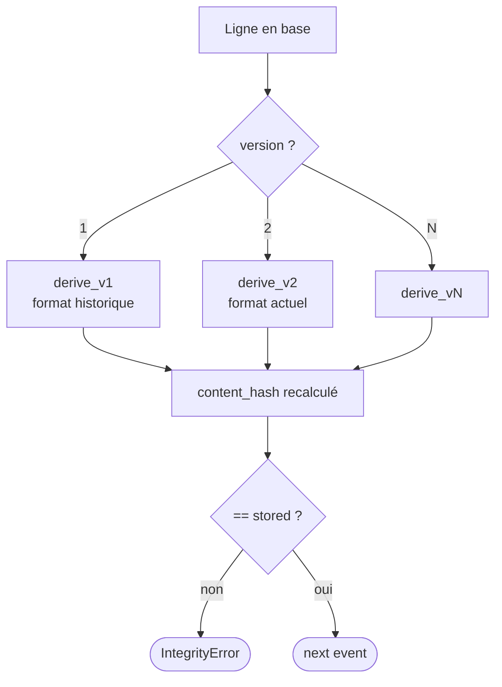

# Compatibilité descendante du format de hash

## Problème

Toute la sécurité du store repose sur la stabilité de la sérialisation canonique :

```python
json.dumps(obj, sort_keys=True, separators=(",", ":"), ensure_ascii=False)
```

Le moindre changement (ajout d'un champ obligatoire, renommage, modification de l'encodage Unicode, changement d'algo de hash) **invalide tous les hashs antérieurs**. Lorsque `verify_integrity()` ([event_store/store.py:554](../../event_store/store.py#L554)) re-dérive `content_hash` avec le nouveau format, le résultat ne correspond plus au `content_hash` stocké → `IntegrityError` partout.

C'est un piège silencieux : le code passe les tests sur des chaînes neuves, et plante en production sur les chaînes historiques.

## Options et tradeoffs

| Option | Idée | Migration | Risque |
|---|---|---|---|
| **Verrouiller à vie** | Ne jamais changer le format | Aucune | Bug majeur dans le format = irréparable sans casser tout |
| **Champ `hash_format_version`** | Persister la version du format dans chaque event ; re-dériver avec le bon dériveur selon la version | Aucune sur l'historique ; nouveaux events portent v2+ | Code de re-dérivation grossit avec chaque version |
| **Re-signature globale** | Au passage à v2, ré-émettre tous les events sous le nouveau format avec re-signature | Coût O(n) × signatures × pairs ; impossible si des pairs sont indisponibles | Casse l'append-only conceptuel |
| **Chaîne v2 distincte** | Sceller l'ancienne chaîne par un événement `format.frozen{v1_head_hash}`, démarrer une chaîne v2 ancrée dessus | Simple, additive | Audit traverse plusieurs chaînes |

## Recommandation

**Champ `hash_format_version`** dans le payload (ou en colonne dédiée). Le coût marginal est nul, le code de re-dérivation est conditionnel mais simple, et l'historique reste auditable indéfiniment.

```python
HASH_FORMAT_VERSION = 1  # incrémenté à chaque changement de format

def compute_content_hash_v1(...) -> str: ...
def compute_content_hash_v2(...) -> str: ...

_DERIVERS = {1: compute_content_hash_v1, 2: compute_content_hash_v2}

def derive(ev) -> str:
    return _DERIVERS[ev.hash_format_version](...)
```

## Schéma proposé

Ajouter une colonne dans [event_store/schema.py](../../event_store/schema.py) :

```sql
ALTER TABLE events ADD COLUMN hash_format_version INTEGER NOT NULL DEFAULT 1;
```

Et dans `compute_content_hash` :

```python
def compute_content_hash(*, hash_format_version: int = 1, ...) -> str:
    if hash_format_version == 1:
        body = {...}  # format actuel
    elif hash_format_version == 2:
        body = {..., "extra_field": ...}  # nouveau format
    else:
        raise ValueError(f"unsupported hash_format_version={hash_format_version}")
    return hashlib.sha256(_canonical_json(body)).hexdigest()
```

L'audit lit `hash_format_version` de la ligne et appelle le bon dériveur — aucune ambiguïté.



## Intégration au store actuel

- **Fichiers touchés** : [event_store/store.py](../../event_store/store.py) (ajout du paramètre, dispatch entre versions) ; [event_store/schema.py](../../event_store/schema.py) (colonne).
- **Migration** : `ALTER TABLE` pour les bases existantes. Les events historiques ont implicitement `hash_format_version=1` (default).
- **Tests** : un test de régression doit vérifier qu'un event v1 fixé en dur (avec son hash attendu) reste valide après chaque évolution du code.

## Limites / risques

- **Explosion combinatoire** : si tu accumules trop de versions, le code devient un musée. Règle pragmatique : retire les anciennes versions seulement quand aucune chaîne en production n'en contient (audit *one shot* qui re-signe l'historique vers la version la plus récente).
- **Cascading hash** : `row_hash = SHA-256(content_hash || parents)` — si tu changes la dérivation des parents (par ex. nouvel ordre), c'est aussi un changement de format à versionner. Le `hash_format_version` couvre les deux.
- **Inter-format chaining** : la tête v2 référence des `parent_hashes` calculés en v1. C'est OK car le `row_hash` du parent reste byte-identique — on ne le re-calcule jamais. Seule la *dérivation pour audit* dépend de la version.
