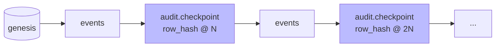

# Audit incrémental de la chaîne

## Problème

`SQLEventStore.verify_integrity()` ([event_store/store.py:554](../../event_store/store.py#L554)) re-dérive **tous** les `content_hash` et `row_hash` et re-vérifie **toutes** les signatures depuis le genesis. Coût : O(n) avec un facteur cryptographique non négligeable (Ed25519 ≈ 50 µs/vérification ; n × `peer_quorum` vérifications).

À 100 k événements et `peer_quorum=3`, un audit complet prend déjà plusieurs secondes ; à 10 M, c'est plusieurs minutes pendant lesquelles la machine est saturée. Si l'audit tourne toutes les heures, on ne tient pas.

## Options et tradeoffs

| Option | Idée | Coût audit | Force de garantie |
|---|---|---|---|
| **Statu quo** | Re-vérifier tout | O(n) | Maximale |
| **Checkpoints signés** | Toutes les N entrées, un événement `audit.checkpoint` portant le `row_hash` de la tête est commité, signé par un quorum d'auditeurs | O(Δ) où Δ = entrées depuis le dernier checkpoint valide | Forte si quorum d'auditeurs distinct du quorum d'émetteurs |
| **Merkle tree par tranches** | Construire un arbre de Merkle par tranche de N événements ; ne re-vérifier qu'une tranche à la fois | O(N) par tranche, audit complet O(n) mais distribuable | Identique au statu quo, mieux parallélisable |
| **Audit échantillonné** | Re-vérifier k entrées tirées au hasard à chaque tour | O(k) constant | Probabiliste — détecte une falsification de p % avec confiance 1−(1−p)^k |
| **Hybride** | Checkpoints + audit échantillonné entre deux | O(k) en routine, O(Δ) au checkpoint | Forte en moyenne, certaine au checkpoint |

## Recommandation

**Hybride** : checkpoints toutes les N=10 000 entrées + échantillonnage continu entre deux. Le checkpoint est lui-même un événement standard (`event_type="audit.checkpoint"`) — il hérite du quorum, des signatures, du chaînage. Un checkpoint compromis serait détecté au checkpoint suivant.



L'audit incrémental :

1. trouve le dernier checkpoint valide (re-vérifie son contenu et son quorum) ;
2. re-vérifie chaque événement entre ce checkpoint et la tête ;
3. au passage, si la tête a franchi un nouveau multiple de N, émet un nouveau `audit.checkpoint`.

## Schéma proposé

```python
def verify_integrity_incremental(self, *, since_row_id: int = 0) -> int:
    """Re-vérifie depuis le dernier checkpoint si since_row_id == 0,
    sinon depuis since_row_id. Retourne l'id du dernier événement vérifié."""
    last_cp = self._last_valid_checkpoint(min_id=since_row_id)
    start = last_cp.id if last_cp else since_row_id
    # Re-dériver hashs et signatures uniquement pour [start, head].
    ...
    return head_id
```

Un événement `audit.checkpoint` :

```json
{
  "event_type": "audit.checkpoint",
  "payload": {
    "row_hash_at_checkpoint": "abc123...",
    "height": 10000,
    "checkpoint_format_version": 1
  }
}
```

## Intégration au store actuel

- **Fichier touché** : [event_store/store.py](../../event_store/store.py) — ajout de `verify_integrity_incremental()` à côté de `verify_integrity()`. Le full audit est conservé pour les cas extrêmes.
- **Pas de migration** : un journal sans checkpoint existant fonctionne — l'audit incrémental tombe en O(n) sur la première passe puis émet le premier checkpoint.
- **Contrainte** : le checkpoint doit traverser le quorum d'attestation comme n'importe quel événement. Un pair compromis ne peut pas falsifier un checkpoint sans complicité.

## Limites / risques

- **Faux sentiment de sécurité** : un attaquant qui contrôle ≥ `peer_quorum` peers peut faire passer un faux checkpoint. Mitigation : avoir un *quorum d'auditeurs* distinct du quorum d'émetteurs (rôles séparés dans `peers`).
- **Échantillonnage** : ne détecte une falsification rare qu'avec une probabilité, pas une certitude. À combiner systématiquement avec les checkpoints.
- **Granularité de N** : N trop petit → pollue la chaîne d'événements `audit.checkpoint` ; trop grand → audit incrémental presque aussi cher qu'un full. Mesurer empiriquement, viser ~10 k.

## Voir aussi

- [HASH_FORMAT_VERSIONING.md](HASH_FORMAT_VERSIONING.md) — l'audit doit utiliser le bon dériveur par version
- [KEY_ROTATION.md](KEY_ROTATION.md) — les révocations changent la validité des quorums historiques
- [SHARDING.md](../scale/SHARDING.md) — audit par shard, par maîtresse, puis cross-check
- [COLD_ARCHIVE.md](../operations/COLD_ARCHIVE.md) — l'audit doit traverser les tranches archivées
- [CHAOS_TESTING.md](../operations/CHAOS_TESTING.md) — l'invariant *« verify_integrity passe »* en property-based
