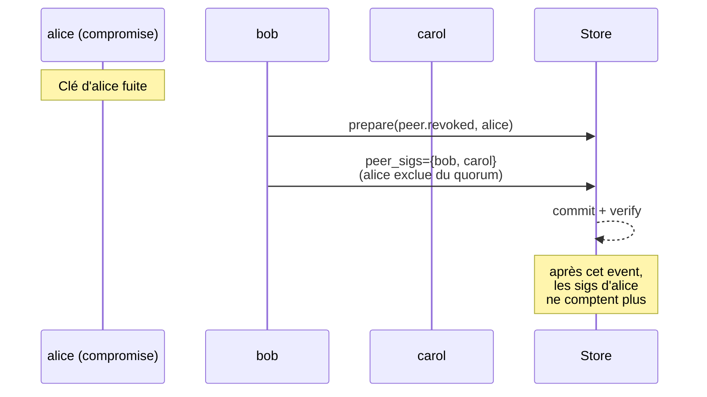

# Rotation et révocation des clés de pair

## Problème

Une clé Ed25519 enregistrée dans `peers` est valide pour toujours. Si elle est compromise (vol, fuite mémoire, employé qui part), il n'existe aujourd'hui aucun moyen de la révoquer :

- les triggers SQL bloquent `UPDATE`/`DELETE` sur `peers` ([event_store/schema.py](../../event_store/schema.py)) ;
- `verify_integrity()` ([event_store/store.py:554](../../event_store/store.py#L554)) accepte indéfiniment les attestations signées par la clé compromise.

Une clé compromise = un pair fantôme qui peut atteindre le quorum à perpétuité.

## Options et tradeoffs

| Option | Idée | Effet sur l'historique | Complexité |
|---|---|---|---|
| **Révocation hors-bande** | Liste de révocation maintenue ailleurs | Aucun ; audit doit consulter une source externe | Casse l'auto-suffisance du journal |
| **Événement `peer.revoked`** | Émettre un événement signé par un quorum hors du peer révoqué | Audit interprète le journal ; les attestations postérieures du peer révoqué ne comptent plus | Modifie la sémantique de `verify_integrity` |
| **Re-keying par `peer.rotated`** | Émettre `peer.rotated{peer_id, old_pk, new_pk, valid_from_height}` | Le peer continue d'exister, change juste de clé à partir de H | Continuité d'identité |
| **Chaîne d'identité par peer** | Chaque clé est elle-même validée par la précédente (ancrage en chaîne) | Auditable de bout en bout | Plus invasif |

## Recommandation

**Combiner `peer.revoked` et `peer.rotated`** comme événements métier de premier ordre, interprétés par `verify_integrity()`.

- `peer.revoked{peer_id}` : à partir de cet événement, les attestations de `peer_id` ne comptent plus dans le quorum. Doit être attesté par un quorum **excluant** le peer révoqué.
- `peer.rotated{peer_id, new_public_key_hex}` : à partir de cet événement, le peer reste valide mais avec la nouvelle clé. Doit être signé par **l'ancienne** clé (preuve de possession) **ET** attesté par un quorum.



## Schéma proposé

```python
# Émission d'une révocation
prepared = bob.prepare(
    event_type="peer.revoked",
    payload={"peer_id": "alice", "reason": "key_compromised"},
)
# alice ne signe PAS — elle est exclue du quorum pour ce type d'événement
prepared.peer_sigs["bob"]   = bob.keypair.sign(msg)
prepared.peer_sigs["carol"] = carol.keypair.sign(msg)
prepared.peer_sigs["dave"]  = dave.keypair.sign(msg)  # quorum=3 sans alice
store.commit(prepared)
```

Côté audit, maintenir un état glissant :

```python
revoked_at: dict[str, int] = {}   # peer_id -> row_id de révocation
keys: dict[str, str] = {peer.peer_id: peer.public_key_hex for peer in store.list_peers()}

for ev in store.read_all():
    if ev.event_type == "peer.revoked":
        revoked_at[ev.payload["peer_id"]] = ev.id
    elif ev.event_type == "peer.rotated":
        keys[ev.payload["peer_id"]] = ev.payload["new_public_key_hex"]

    # Compter les sigs valides ET non-révoquées au moment de cet événement
    valid = sum(
        1 for pid, sig in ev.peer_sigs.items()
        if pid in keys
        and (pid not in revoked_at or revoked_at[pid] > ev.id)
        and verify_signature(keys[pid], sig, ...)
    )
    if valid < self.peer_quorum:
        raise IntegrityError(...)
```

## Intégration au store actuel

- **Fichier touché** : [event_store/store.py](../../event_store/store.py) — `_insert_one()` et `verify_integrity()` deviennent conscients de la sémantique `peer.revoked`/`peer.rotated`.
- **Pas de modification de schéma SQL** : ce sont des événements ordinaires.
- **Pas de modification de la table `peers`** : elle reste l'autorité initiale, mais la chaîne fait foi pour l'état courant.

## Limites / risques

- **Quorum dégradé** : avec 3 pairs et `peer_quorum=3`, révoquer un pair empêche tout commit suivant — il faut au moins 4 pairs pour pouvoir en révoquer un. Règle d'opération : provisionner `peer_quorum + 1` pairs minimum.
- **Race de révocation** : entre le moment où la clé fuite et l'événement `peer.revoked`, l'attaquant peut commiter avec sa clé. Mitigation : monitorer les émissions et alerter sur des patterns anormaux (cf. [docs/operations/OBSERVABILITY.md](../operations/OBSERVABILITY.md)).
- **Rotation auto-signée** : `peer.rotated` est signé par l'ancienne clé — mais si la clé est déjà compromise, l'attaquant peut rotater vers sa propre clé. Pour une rotation post-compromis, **toujours combiner `peer.revoked` (clé compromise) + `peer.added` (nouvelle identité)** plutôt qu'une rotation.
- **Re-key avant fuite** : la rotation préventive (par hygiène) ne protège **pas** contre une fuite de l'ancienne clé qui aurait commit dans le passé — l'attaquant garde le pouvoir de prouver des attestations historiques. Pour ça, voir `audit.checkpoint` ([INCREMENTAL_AUDIT.md](INCREMENTAL_AUDIT.md)) qui scelle l'état.

## Voir aussi

- [INCREMENTAL_AUDIT.md](INCREMENTAL_AUDIT.md) — les checkpoints scellent l'historique pré-fuite
- [OBSERVABILITY.md](../operations/OBSERVABILITY.md) — détecter les patterns anormaux post-compromise
- [CONSUMER_OFFSETS.md](../distribution/CONSUMER_OFFSETS.md) — les consommateurs doivent appliquer la même règle d'exclusion
- [CHAOS_TESTING.md](../operations/CHAOS_TESTING.md) — tester l'interaction révocation + quorum
