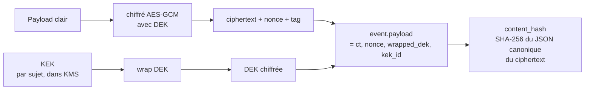

# Chiffrement du payload at rest

## Problème

Le `payload` d'un événement est stocké en clair dans la colonne `events.payload` ([event_store/schema.py](../../event_store/schema.py)). Toute personne ayant accès au fichier SQLite peut lire :

- des données métier sensibles (montants, identifiants client) ;
- des données personnelles soumises au RGPD (nom, email, IP) ;
- des secrets glissés par erreur (tokens, paramètres internes).

Le hash et la signature protègent l'**intégrité**, pas la **confidentialité**. Et copier un fichier `.db` est trivial pour un opérateur ou un attaquant.

## Options et tradeoffs

| Option | Idée | Auditabilité | Granularité |
|---|---|---|---|
| **Chiffrement disque** (LUKS, FileVault) | Le fichier `.db` est sur un volume chiffré | Identique à aujourd'hui | Tout-ou-rien : un opérateur autorisé voit tout |
| **SQLCipher** | SQLite chiffrant le fichier entier | Identique | Idem ; plus une dépendance |
| **Chiffrement par champ** (envelope) | Chaque payload est chiffré, la clé symétrique est elle-même chiffrée par une clé maître | Hash sur le ciphertext → audit OK ; lecture conditionnée à la KEK | Par événement, par tenant, par sujet… |
| **Chiffrement déterministe** | Permet de matcher (`WHERE`) sans déchiffrer | Idem | Compromis confidentialité (révèle l'égalité) |

## Recommandation

**Envelope encryption par sujet** : chaque payload est chiffré avec une clé de données (DEK) unique, elle-même chiffrée par la clé du sujet (KEK). La KEK vit dans un KMS / HSM ; détruire une KEK rend illisibles tous les payloads de ce sujet (utile pour le RGPD — voir [GDPR_CRYPTO_SHREDDING.md](../data/GDPR_CRYPTO_SHREDDING.md)).

**Le hash porte sur le ciphertext**, pas sur le clair. Sinon il faudrait déchiffrer pour auditer, ce qui couple audit et accès aux secrets.



## Schéma proposé

Le `payload` reste un dict JSON, mais avec une convention :

```json
{
  "encrypted": true,
  "kek_id": "subject:account:ACC-001",
  "alg": "AES-256-GCM",
  "nonce": "base64...",
  "ciphertext": "base64...",
  "tag": "base64...",
  "wrapped_dek": "base64...",
  "aad": {"event_type": "deposit.made"}  // authentifié non chiffré
}
```

Helper côté client :

```python
class EncryptedClient(Client):
    def __init__(self, *args, kms, **kwargs):
        super().__init__(*args, **kwargs)
        self.kms = kms

    def prepare_encrypted(self, *, event_type, plaintext_payload, kek_id):
        envelope = self.kms.encrypt(plaintext_payload, kek_id)
        return self.prepare(event_type=event_type, payload=envelope)
```

Lecture :

```python
def read_decrypted(self, ev: StoredEvent, kms):
    if not ev.payload.get("encrypted"):
        return ev.payload
    return kms.decrypt(ev.payload)
```

## Intégration au store actuel

- **Aucune modification du `core`** : le store ne sait pas qu'il y a chiffrement, il hash et signe le ciphertext comme n'importe quel JSON.
- **Couche au-dessus** : un wrapper `EncryptedClient` (ou un middleware) gère encrypt/decrypt et la résolution des KEK.
- **Métadonnées au clair** : `event_type`, `issuer_id`, `hlc_*`, `nonce` — délibérément, pour pouvoir indexer et trier sans déchiffrer.

## Limites / risques

- **Métadonnées révélatrices** : `event_type="deposit.made"` + `issuer_id="alice"` + `hlc_physical_ms` permet déjà des inférences. Si c'est un risque, prévoir une couche de pseudonymisation (event_type → opaque token, issuer_id → pseudonyme tournant).
- **AAD (additional authenticated data)** : à inclure obligatoirement le `event_type` et le `issuer_id` dans l'AAD GCM, sinon un attaquant peut copier-coller un ciphertext valide d'un type d'événement vers un autre.
- **Rotation de KEK** : prévoir une procédure (ré-encryption des DEK avec la nouvelle KEK ; les ciphertexts ne changent pas → les hashs non plus → l'audit reste valide).
- **Perte de KEK = perte de la donnée** — c'est par construction (et c'est ce qui rend le crypto-shredding possible). Sauvegardes de KEK obligatoires.
- **Recherches** : on ne peut plus faire `WHERE payload LIKE '%alice%'`. Pour les recherches égalitaires, encryption déterministe sur les champs concernés ; pour les recherches plein texte, indexer dans un service séparé après déchiffrement applicatif.
